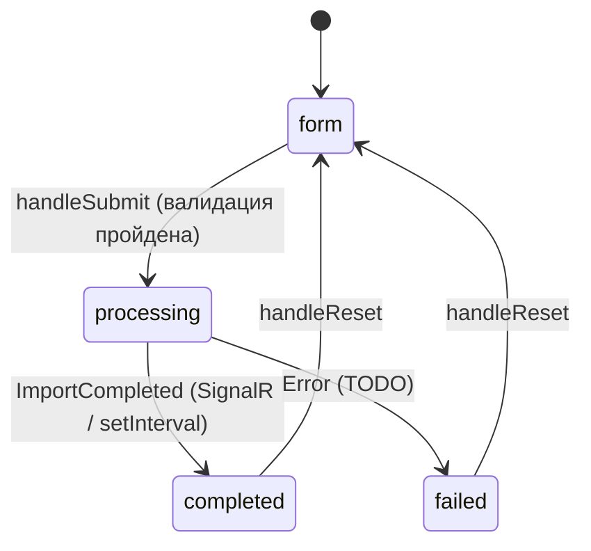

# 🔄 Поток импорта в UI

## 📋 Описание

Документ описывает пользовательский путь (user flow) от выбора параметров до получения подробного отчёта импорта в UI-прототипе. Также фиксирует, **как должна работать** интеграция с backend (SignalR) при переходе от моков к реальному API.

---

## 🎬 Stages и переходы



| Stage | Описание | Источник состояния |
|-------|----------|---------------------|
| `form` | Заполнение формы параметров | Локальный state в `App.tsx` |
| `processing` | Импорт идёт, прогресс обновляется | SignalR `ProgressUpdated` (моки: setInterval) |
| `completed` | Отчёт готов | SignalR `ImportCompleted` + `GET /api/import/{id}/report` |

---

## 📝 Stage 1: Form (заполнение параметров)

### Поля формы (порядок сверху вниз)

1. **Тип импорта** — `ImportTypePicker` (`Select` из `IMPORT_TYPES`)
   - 8+ типов: `rooms`, `shareAgreements`, `mixed`, `paymentSchedule`, `escrowAccounts`, ...
   - Список расширяемый (см. `mocks/importTypes.ts`)
   - В будущем подгружается с backend через `GET /api/import/types`

2. **Проект** — `Select`
   - Источник: `MOCK_PROJECTS` → будет `POST /api/listview/constructionproject`
   - При смене проекта **автоматически** сбрасывается выбранный объект

3. **Объект строительства** — `Select`
   - Источник: `MOCK_SITES[projectId]` → будет `POST /api/listview/constructionsite?filter=...`
   - **Disabled** пока не выбран проект

4. **Загрузка файла** — `Dropzone` + `FileUploadItem`
   - Drag-and-drop или клик для выбора (любой из CSV / XLS / XLSB / XLSX)
   - **Формат определяется автоматически** по расширению (`detectFileFormat`)
   - После загрузки: `FileUploadItem` + бейдж определённого формата (`Status`)
   - Если расширение не поддерживается — ошибка под Dropzone

> 📝 Поле «Формат файла» (RadioGroup/Tabs) **удалено** — формат определяется автоматически. См. [05-file-format-detection.md](./05-file-format-detection.md).
>
> 📝 Поля «Дата начала» / «Дата окончания» импорта **в форме отсутствуют** — это информационные поля, фиксируются backend'ом автоматически (`startedAt` при приёме файла, `completedAt` при завершении) и отображаются в отчёте как `DateTime` в формате `DD.MM.YYYY HH:mm:ss`.

### Валидация

```ts
const detectedFormat = useMemo(
  () => (file ? detectFileFormat(file.name) : null),
  [file]
);

const canSubmit =
  importType !== null
  && projectId !== null
  && siteId !== null
  && file !== null
  && detectedFormat !== null;   // 👈 валидация: формат должен быть распознан
```

```tsx
<Button disabled={!canSubmit} onClick={handleSubmit}>
  Запустить импорт
</Button>
```

### ⚠️ Важно
- **Не показываем** Alert "заполните поля" — это лишний шум. Достаточно `disabled` на кнопке.
- При **потере выбора проекта** — обнуляем выбор объекта (`onSiteChange(null)` в `onProjectChange`).

---

## ⏳ Stage 2: Processing (имитация SignalR)

### ✅ Текущая реализация (моки)

```tsx
// App.tsx
const handleSubmit = () => {
  setStage('processing');
  setProgress({ ...MOCK_PROGRESS, currentRow: 0, percentComplete: 0 });

  let cur = 0;
  const total = MOCK_PROGRESS.totalRows;
  const interval = setInterval(() => {
    cur += Math.ceil(total / 25);  // 👈 25 шагов = ~5 сек на 200ms
    if (cur >= total) {
      clearInterval(interval);
      setProgress({ ...MOCK_PROGRESS, currentRow: total, percentComplete: 100 });
      setReport(MOCK_REPORT);       // 👈 итоговый отчёт
      setStage('completed');
    } else {
      setProgress({ ...MOCK_PROGRESS, currentRow: cur, percentComplete: Math.round((cur/total)*100) });
    }
  }, 200);
};
```

### 🔌 Будущая реализация (SignalR)

```tsx
// hooks/useImportProgress.ts (TODO)
export const useImportProgress = (importId: string | null) => {
  const [progress, setProgress] = useState<ImportProgress | null>(null);
  const [report, setReport] = useState<ImportReport | null>(null);

  useEffect(() => {
    if (!importId) return;
    const conn = new HubConnectionBuilder()
      .withUrl('/hubs/import-progress')
      .build();

    conn.on('ProgressUpdated', setProgress);
    conn.on('RowProcessed', (row) => {
      setReport(prev => prev ? { ...prev, rows: [...prev.rows, row] } : prev);
    });
    conn.on('ImportCompleted', async () => {
      const finalReport = await fetch(`/api/import/${importId}/report`).then(r => r.json());
      setReport(finalReport);
    });

    conn.start().then(() => conn.invoke('SubscribeToImport', importId));
    return () => { conn.stop(); };
  }, [importId]);

  return { progress, report };
};
```

### ⚠️ Важно
- В моках имитация ~5 секунд. На реальном backend длительность зависит от размера файла.
- При переходе на SignalR **сохраняем** UI-структуру: `ReportProgress` уже принимает `ImportProgress` напрямую.

---

## ✅ Stage 3: Completed (подробный отчёт)

### Структура отчёта (вертикально)

```
┌────────────────────────────────────────┐
│  ReportSummary                         │  ← заголовок + 8 карточек метрик
│  - Файл: import.xlsx                   │
│  - Тип: Помещения + ДДУ                │
│  - Длительность: 00:02:35              │
│                                        │
│  [Всего] [Создано] [Обнов.] [Пропущ.] │
│  [Создано ДДУ] [Обнов. ДДУ] ...       │
├────────────────────────────────────────┤
│  Divider                               │
├────────────────────────────────────────┤
│  ReportTable                           │
│                                        │
│  [Все] [Успешные] [Предупр.] [Ошибки] │  ← фильтр-теги
│                                        │
│  ┌─────────────────────────────────┐   │
│  │  №  Лист  Статус  Источник  ... │   │  ← заголовки таблицы
│  ├─────────────────────────────────┤   │
│  │  1  Реест Успех   roomNumber:101│   │
│  │     ↓ [Подробнее]               │   │
│  │  ┌─Collapse────────────────┐    │   │  ← раскрытые детали
│  │  │ Исх.строка | Назначение │    │   │
│  │  │ Предупреж. | Ошибки     │    │   │
│  │  └─────────────────────────┘    │   │
│  └─────────────────────────────────┘   │
└────────────────────────────────────────┘
```

### Карточки сводки (8 метрик)

| Карточка | Цвет | Источник |
|----------|------|----------|
| Всего строк | secondary | `summary.totalRows` |
| Помещений создано | positive (зелёный) | `summary.roomsCreated` |
| Помещений обновлено | link (синий) | `summary.roomsUpdated` |
| ДДУ создано | positive | `summary.shareAgreementsCreated` |
| ДДУ обновлено | link | `summary.shareAgreementsUpdated` |
| Пропущено | secondary | `roomsSkipped + shareAgreementsSkipped` |
| Предупреждений | attention (оранжевый) | `summary.warningsCount` |
| Ошибок | negative (красный) | `summary.errorsCount` |

### Фильтр-теги

```ts
type Filter = 'all' | 'success' | 'warning' | 'error';

const filtered = useMemo(() => {
  if (filter === 'all') return rows;
  return rows.filter(r => r.status === filter);
}, [rows, filter]);
```

⚠️ **Не используем** `@alfalab/core-components-filter-tag` — он требует более сложной модели (с возможностью удалять). Используем кастомный `<button class="filter-tag">` для простоты.

### Раскрытие деталей строки (Collapse)

```ts
const [expanded, setExpanded] = useState<number | null>(null);

const handleToggle = (rowNumber: number) => {
  setExpanded(prev => prev === rowNumber ? null : rowNumber);
};
```

### ⚠️ Важно — Collapse в таблице

Чтобы корректно раскрывать строки внутри `<table>`, используем **парные `<tr>`**:

```tsx
{filtered.map(row => (
  <>
    {/* Основная строка */}
    <tr key={`r-${row.rowNumber}`}>...</tr>

    {/* Строка с деталями (раскрываемая) */}
    <tr key={`d-${row.rowNumber}`} className="row-details">
      <td colSpan={6} style={{ padding: 0, borderBottom: 'none' }}>
        <Collapse expanded={isOpen}>
          <div className="row-details__content">...</div>
        </Collapse>
      </td>
    </tr>
  </>
))}
```

### ❌ Типичная ошибка

```tsx
{/* НЕПРАВИЛЬНО — Collapse внутри ячейки таблицы ломает структуру */}
<tr>
  <td>
    <Collapse>...</Collapse>  {/* ❌ нарушает grid таблицы */}
  </td>
</tr>
```

---

## 🎨 Цветовое кодирование строк

```css
.row--error    { background: #fef4f4; }   /* красноватый */
.row--warning  { background: #fffaf0; }   /* желтоватый */
/* успешные строки — без фона */
```

⚠️ **Не используем** `Status` для подсветки строк — только для бейджа в колонке статуса. Подсветка фона через CSS-классы быстрее и не зависит от Alfa-стилей.

---

## 🎯 Чек-лист при изменении flow импорта

- [ ] Изменение состояния — только в `App.tsx` (или новом редьюсере)
- [ ] Все промежуточные состояния отражены в `Stage` union
- [ ] При добавлении новых событий SignalR — обновлены `useImportProgress` хук и моки
- [ ] При добавлении новых полей формы — обновлён `canSubmit` и `ImportRequest` тип
- [ ] При новых полях отчёта — обновлены `ImportReport` тип и `MOCK_REPORT`
- [ ] При изменении количества карточек сводки — обновлена сетка `.report-summary__cards` (grid-template-columns)

---

## 📍 Применение в проекте

| Шаг flow | Файл | Ключевые функции |
|----------|------|------------------|
| Стейт-машина | `KiloImportService.Web/src/App.tsx` | `Stage`, `handleSubmit`, `handleReset` |
| Прогресс | `KiloImportService.Web/src/components/ImportReport/ReportProgress.tsx` | `ProgressBar` |
| Сводка | `KiloImportService.Web/src/components/ImportReport/ReportSummary.tsx` | 8 карточек |
| Таблица | `KiloImportService.Web/src/components/ImportReport/ReportTable.tsx` | Фильтры, Collapse |
| Моки | `KiloImportService.Web/src/mocks/data.ts` | `MOCK_PROGRESS`, `MOCK_REPORT` |
