# 📥 Импорт финмодели — пользовательский флоу

> Документ описывает сквозную логику импорта типа «Финмодель» для аналитика на бизнес-языке. Готовится как пользовательская инструкция в стиле эталонных страниц BPM («4.1 шаг. Добавление Операции по счетам»).

---

## Список систем

| Система | Сокращение | Описание |
|---------|------------|----------|
| Аналитик | USER | Сотрудник, который собирает Excel-файлы и запускает импорт |
| Веб-интерфейс сервиса импорта | WEB | Браузерное приложение, в котором аналитик выбирает проект, объект и загружает файлы |
| Сервис импорта | API | Серверная часть: читает Excel, проверяет данные, отправляет запросы в Альфа-Билдинг. Ведёт собственный журнал сессии импорта |
| Альфа-Билдинг | AB | Целевая учётная система застройщика. Хранит проекты, объекты строительства, ИСР, графики финансирования, сделки, финансовые модели, заключения |

---

## Схема процесса

```plantuml
@startuml
title Импорт финмодели — последовательность

actor "Аналитик" as USER
participant "Веб-интерфейс" as WEB
participant "Сервис импорта" as API
database  "Журнал сессии" as DB
participant "Альфа-Билдинг" as AB

== Подготовка и загрузка ==
USER -> WEB: Открывает форму, выбирает «Финмодель»
WEB -> AB: Запрашивает список проектов и объектов
AB --> WEB: Возвращает справочники
USER -> WEB: Выбирает Проект и Объект,\nприкладывает основной файл\n(опц. файл «План»)
USER -> WEB: Нажимает «Запустить»
WEB -> API: Передаёт файлы
API -> DB: Создаёт сессию импорта,\nсохраняет файлы

== Чтение и проверка файлов ==
note over API: На этом этапе обращений в Альфа-Билдинг нет —\nтолько чтение Excel и проверка ячеек
API -> API: Читает листы «Управляющий», «Параметры»,\n«Итоги» (и при наличии — файл «План»)
API -> API: Проверяет ячейки и собирает строки данных
API -> DB: Сохраняет строки данных,\nсписок ошибок и предупреждений
API --> WEB: Готов отчёт о проверке
WEB --> USER: Показывает отчёт и кнопку «Применить»

alt Аналитик отказался
  USER -> WEB: Закрывает / отменяет сессию
else Аналитик нажал «Применить»
  USER -> WEB: «Применить»
  WEB -> API: Команда на применение

  == Применение: Финансовая модель (раньше всего) ==
  note over API
    Запускается первой, до проверок сделки и бюджета,
    потому что работает по файлу «План» и не зависит
    от данных основного файла.
  end note
  alt Файл «План» не приложен
    API -> DB: Предупреждение «Файл с планами не приложен —\nФинансовая модель не создавалась»
  else Файл «План» приложен, заданы Проект и Объект
    API -> API: Читает лист «Общий график» из файла «План»\n→ границы периодов (с какого по какой квартал)\nи точки данных по типам помещений
    alt Файл не прочитался
      API -> DB: Ошибка «Не удалось прочитать файл с планами» → выход
    end
    API -> AB: Сначала проверяет:\nесть ли уже Финансовая модель\nдля этого Проекта и Объекта\nна тот же диапазон периодов
    alt Проверка не прошла по сети
      API -> DB: Ошибка «Не удалось проверить наличие модели»\nСоздание пропускается (защита от дубликата) → выход
    else Финансовая модель уже есть
      AB --> API: Возвращает существующую
      API -> DB: Предупреждение «Финансовая модель уже создана»\nИдентификатор запоминается для версии
    else Финансовой модели нет
      API -> AB: Получает название проекта
      note right of API: Если запрос не прошёл —\nпродолжает без названия проекта
      API -> API: Опционально читает квартал ввода\nв эксплуатацию с управляющего листа\nосновного файла (раздел «Конфигурация этапов»,\nЭтап 1, дата разрешения на ввод)
      API -> AB: Создаёт Финансовую модель\n(название модели, название проекта,\nпроект, объект, границы периодов,\nквартал ввода в эксплуатацию)
      alt Создание не удалось
        API -> DB: Ошибка «Не удалось создать Финансовую модель» → выход
      else Создана
        AB --> API: Возвращает идентификатор модели
      end
    end

    API -> AB: Получает справочник «Коды финансовой модели»\n(по каждому уникальному коду из файла отдельно)
    alt Справочник недоступен по сети
      API -> DB: Ошибка «Не удалось получить справочник кодов» → выход
    end
    API -> AB: Получает список существующих версий модели\n(чтобы посчитать максимальный номер в имени)
    API -> AB: Создаёт новую Версию модели:\nпервая — «Версия — Перенос из Эксель»,\nпоследующие — «… 2», «… 3» и так далее
    alt Создание не удалось
      API -> DB: Ошибка «Не удалось создать Версию модели» → выход
    else
      AB --> API: Возвращает идентификатор версии
    end

    loop По каждой паре «тип помещения × квартал» из файла «План»
      alt Код категории не найден в справочнике
        note right of API: Точка пропускается,\nкод запоминается в списке отсутствующих
      else
        API -> AB: Создаёт Входные данные\n(квартал, код, сумма, площадь, цена)\nи привязывает их к Версии модели
      end
    end
    alt Были пропуски по справочнику
      API -> DB: Предупреждение «Часть кодов\nне найдена в справочнике»
    end
    alt Были ошибки при создании
      API -> DB: Предупреждение «Часть Входных данных\nне создалась»
    end

    loop По строкам раздела «Финансирование: Этап 1»\n(вложение собственных средств)
      alt Сумма заполнена и не равна нулю
        API -> AB: Создаёт Входные данные (вложение собственных средств)\nи привязывает к Версии модели
      else Сумма пустая или нулевая
        note right of API: Квартал пропускается
      end
    end
    alt На листе «Итоги» отмечен блок «Факт»
      API -> AB: Создаёт Фактические данные\nпо типам помещений и привязывает к Версии модели
    else Блока «Факт» нет
      note right of API: Факт-блок пропускается без ошибки
    end
  end

  == Применение: Параметры объекта ==
  alt В файле есть данные параметров объекта
    API -> AB: Сначала проверяет: есть ли сделка\nпо «Номеру КД» в выбранном Проекте
    alt Сделка нашлась в другом Проекте
      AB --> API: Конфликт
      API -> DB: Ошибка «Сделка относится к другому Проекту»,\nпараметры объекта НЕ применяются
    else Сделка найдена в нашем Проекте или её нет нигде
      alt Сделки нигде нет
        API -> AB: Создаёт Сделку с указанным номером
      end
      API -> AB: Обновляет на объекте: тип отделки,\nкласс жилья, строительный адрес,\nплощадь и плотность застройки
      alt Указаны ИНН и Наименование застройщика
        API -> AB: Ищет Организацию по ИНН (или создаёт),\nпривязывает её к Проекту и Объекту
      end
      alt Указана Группа компаний
        API -> AB: Ищет Группу компаний и привязывает её\nк Организации (если не была привязана)
      end
    end
  end

  == Применение: Бюджет (ИСР) ==
  alt В файле есть данные бюджета
    API -> AB: Сначала проверяет: есть ли в ИСР\nобъекта строительства какие-либо статьи
    alt ИСР уже содержит статьи
      AB --> API: Статьи есть
      API -> DB: Предупреждение «ИСР уже сформирована —\nбюджет и график финансирования пропущены»
    else Проверка не прошла по сети
      API -> DB: Бюджет и график пропускаются\n(чтобы не создать дубликат)
    else ИСР пустая
      API -> AB: Отправляет файл бюджета\nв файловое хранилище Альфа-Билдинга
      API -> AB: Запускает обработку бюджета
      loop Опрашивает результат каждые 3 секунды\n(до 5 минут)
        API -> AB: Запрашивает статус
        AB --> API: В работе / Готово /\nГотово с предупреждениями / Ошибка / Таймаут
      end
      alt Готово / Готово с предупреждениями
        note right of API: Бюджет принят,\nграфик финансирования разрешён
      else Ошибка или таймаут
        API -> DB: Ошибка «Бюджет не принят»\n(график финансирования пропускается)
      end
    end
  end

  == Применение: График финансирования главы 1 ==
  alt Бюджет успешно принят в этой же сессии
    API -> AB: Получает список статей ИСР объекта\n(1.1, 1.2 и т. д.)
    loop По каждой квартальной ячейке графика
      API -> AB: Сначала проверяет: есть ли уже\nплановая запись за этот квартал по этой статье
      alt Запись уже есть
        note right of API: Пропуск — не перезаписываем\nручные правки
      else Записи нет
        API -> AB: Создаёт плановую запись\nфинансирования на квартал
      end
    end
  else Бюджет не заливался / не принят / ИСР была сформирована
    API -> DB: Предупреждение «График финансирования\nне создан»
  end

  == Применение: Заключение БП7 + рассрочки + ставки + помесячные ==
  note over API
    Запускается последним — после Финансовой модели,
    Параметров, Бюджета и Графика финансирования.
  end note
  alt Задан Проект
    API -> API: Читает блок «Продажи» с управляющего листа
    alt Ни одна схема рассрочек не включена
      API -> DB: Информация «Нет включённых схем рассрочек —\nЗаключение не создаётся»
    else Включена хотя бы одна схема
      API -> AB: Получает справочник «Виды помещений»
      alt В файле есть «Номер КД»\nи Сделка найдена в нашем Проекте
        loop По каждой включённой ставке Этапа 1
          API -> AB: Создаёт процентную ставку по Сделке
        end
        alt Раздел «Инвестиционный кредит: Этап 1»\nна листе «Итоги» заполнен
          API -> AB: Создаёт помесячные данные по Сделке
        end
      end
      API -> AB: Создаёт Заключение «Итоговое заключение КА БП7»
      API -> AB: Находит автоматически созданный\nНабор данных для финмодели
      loop По каждому включённому виду помещений
        API -> AB: Создаёт Данные по виду помещения
      end
      API -> AB: Обновляет Набор данных для финмодели\n(тройка полей для каждой включённой схемы)
    end
  end

  == Завершение ==
  API -> DB: Сохраняет журнал действий по строкам\nи дополнительные записи
  API -> DB: Помечает сессию как завершённую\n(успешно или с ошибками)
  API --> WEB: Итоговый отчёт
  WEB --> USER: Показывает результат, журнал\nи кнопку «Скачать отчёт»
end
@enduml
```

---

## Шаги процесса

### Подготовка и загрузка

| № | Участник | Действие | Описание |
|---|----------|----------|----------|
| 1 | USER | Открыть форму импорта | В веб-интерфейсе выбрать тип импорта **«Финмодель»** |
| 2 | USER, WEB, AB | Выбрать Проект и Объект | Веб-интерфейс получает списки проектов и объектов из Альфа-Билдинга. Аналитик выбирает значения |
| 3 | USER | Приложить основной файл | Обязательный Excel с управляющим листом, листом параметров и листом итогов |
| 4 | USER | (Опционально) Приложить файл «План» | Дополнительный Excel с листом «Общий график». Если файл не приложен — Финансовая модель в Альфа-Билдинге **не создаётся** (отчёт укажет это явно), но остальные блоки применяются |
| 5 | USER, WEB, API | Запустить импорт | Файлы уходят на сервер. Создаётся сессия импорта, файлы сохраняются. Дальше начинается фоновая обработка |

### Чтение и проверка файлов

> На этом этапе **обращений в Альфа-Билдинг нет**. Сервис работает только с Excel-файлами и собственным журналом сессии. Все обращения в Альфа-Билдинг начинаются на следующем этапе (после нажатия «Применить»).

| № | Участник | Действие | Описание |
|---|----------|----------|----------|
| 6 | API | Прочитать управляющий лист | Берутся: **«Количество этапов»** (сколько квартальных колонок ожидается), **«Номер КД»** (номер договора будущей Сделки), даты ввода объекта в эксплуатацию |
| 7 | API | Прочитать раздел «Основные данные» | **Тип отделки**, **Класс жилья**, **Строительный адрес**, **Площадь застройки**, **Плотность застройки**, **ИНН + Наименование застройщика**, **Группа компаний** |
| 8 | API | Прочитать раздел «Себестоимость» | По иерархии «Глава → Подстатья» собираются суммы по всем этапам. Суммы переводятся в рубли |
| 9 | API | Прочитать раздел «ГФ Главы 1» | По строкам этапа 1 берутся квартальные суммы (до 23 кварталов). Заголовок строки 7 — даты кварталов |
| 10 | API | Прочитать раздел «Финансирование: Этап 1» | Поквартальные суммы по типам помещений — для блока «Вложение собственных средств». Нулевые значения **пропускаются** |
| 11 | API | (Если приложен) Прочитать файл «План» | Из шапки берётся Год (с протяжкой на 4 квартала) и Квартал. По блокам типов помещений собираются три метрики: **площадь/количество**, **цена**, **выручка** |
| 12 | API | Прочитать раздел «Продажи» | Признаки «1 — Да» / «0 — Нет» включают схемы рассрочки: **равномерная ДДУ**, **единовременная ДДУ**, **ДКП**. Для каждой включённой берутся доли и типы помещений |
| 13 | API | Прочитать раздел «Финансирование» | Идентификатор ставки и её процент по каждому коду финансирования Этапа 1 |
| 14 | API | (Если есть блок «Факт») Прочитать факт-блок на листе «Итоги» | Год/Квартал и три метрики (площадь, цена, выручка) по типам помещений за этот период |
| 15 | API | Собрать и сохранить отчёт о проверке | Все находки (отсутствие листа, пустые ячейки, значения не из справочника) попадают в журнал сессии. Сессия переходит в статус «Проверена» (или «Ошибка» при критичных проблемах с файлом) |
| 16 | WEB | Показать отчёт аналитику | Аналитик видит ошибки и предупреждения, может скачать отчёт и выбрать «Применить» или закрыть сессию |

### Применение

> Стартует **только после явного нажатия «Применить»**. Все обращения в Альфа-Билдинг происходят здесь. Порядок выполнения: Финансовая модель → Параметры объекта → Бюджет → График финансирования → Заключение БП7.

#### Финансовая модель (выполняется первой)

| № | Участник | Условие | Действие |
|---|----------|---------|----------|
| 17 | API | Файл «План» **не** приложен | Финансовая модель в Альфа-Билдинге не создаётся. В отчёте — предупреждение «Файл с планами не приложен — Финансовая модель не создавалась». Все остальные блоки продолжают работу |
| 18 | API | Файл «План» приложен, заданы Проект и Объект | Читает лист **«Общий график»** из файла «План» → определяет границы периодов (первый и последний квартал) и точки данных по типам помещений |
| 19 | API | Файл не прочитался | В отчёт — ошибка «Не удалось прочитать лист с планом». Дальнейшие шаги по Финансовой модели пропускаются |
| 20 | API, AB | Файл прочитан | **Предварительная проверка**: ищет в Альфа-Билдинге Финансовую модель для этого Проекта, Объекта и того же диапазона периодов. На одном объекте может быть несколько моделей с разными диапазонами, поэтому периоды учитываются в фильтре |
| 21 | API | Проверка не прошла по сети | В отчёт — ошибка «Не удалось проверить наличие Финансовой модели». Создание пропускается, чтобы **не породить дубликат** |
| 22 | API | Финансовая модель для этого диапазона периодов **уже есть** | Создание пропускается. Идентификатор существующей модели запоминается. В отчёт — предупреждение «Финансовая модель уже создана». Версия и Входные данные при необходимости досоздаются ниже |
| 23 | API, AB | Финансовая модель **не** найдена | Получает название Проекта (если запрос не прошёл — продолжает без него). Опционально читает квартал ввода в эксплуатацию с управляющего листа основного файла (раздел «Конфигурация этапов», Этап 1, дата разрешения на ввод) |
| 24 | API, AB | Подготовка завершена | Создаёт Финансовую модель с полями: название модели, название Проекта, ссылка на Проект, ссылка на Объект, границы периодов, квартал ввода в эксплуатацию. При ошибке создания — «Не удалось создать Финансовую модель», дальнейшие шаги по модели пропускаются |
| 25 | API, AB | Финансовая модель есть/создана | Получает справочник «Коды финансовой модели» по каждому уникальному коду из файла отдельным запросом. Если справочник недоступен по сети — «Не удалось получить справочник кодов» и выход. Коды, для которых ничего не нашлось, запоминаются в списке отсутствующих |
| 26 | API, AB | Коды получены | Получает список существующих Версий модели (нужен только для подсчёта максимального номера в имени). Создаёт новую Версию модели: первая — «Версия — Перенос из Эксель», последующие — «… 2», «… 3» и так далее. **Каждый импорт создаёт новую Версию.** При ошибке создания — «Не удалось создать Версию модели» |
| 27 | API, AB | Версия создана | По каждой паре «тип помещения × квартал» из файла «План» создаёт Входные данные (квартал, код, сумма, площадь, цена) и привязывает их к Версии. Точки с отсутствующими кодами пропускаются |
| 28 | API | По завершении цикла плановых точек | Если есть отсутствующие коды — предупреждение «Часть кодов не найдена в справочнике» со списком. Если были ошибки при создании — предупреждение «Часть Входных данных не создалась» с количеством |
| 29 | API, AB | В файле есть строки «Вложение собственных средств» | По каждому кварталу с непустой ненулевой суммой создаёт Входные данные (вложение собственных средств) и привязывает к Версии модели |
| 30 | API, AB | На листе «Итоги» отмечен блок «Факт» | По типам помещений создаёт Фактические данные в **той же** Версии модели. Если блока «Факт» нет — этот шаг пропускается без ошибки |

#### Параметры объекта

| № | Участник | Условие | Действие |
|---|----------|---------|----------|
| 31 | API, AB | В файле есть данные параметров объекта | **Предварительная проверка Сделки**: ищет в Альфа-Билдинге Сделку по «Номеру КД» в выбранном Проекте |
| 32 | API | Сделка нашлась в **другом** Проекте | Параметры **не применяются**. В отчёт — ошибка «Сделка относится к другому Проекту» |
| 33 | API, AB | Сделка найдена в нашем Проекте или её нет нигде | Если Сделки нигде нет — создаётся новая. Затем на объекте обновляются: тип отделки, класс жилья, строительный адрес, площадь и плотность застройки |
| 34 | API, AB | Указаны ИНН и Наименование застройщика | Ищет Организацию по ИНН (или создаёт новую), привязывает её к Проекту и Объекту. Повторный импорт не создаёт дубликата |
| 35 | API, AB | Указана Группа компаний | Ищет Группу компаний и привязывает её к Организации (если не была привязана раньше) |

#### Бюджет (ИСР)

| № | Участник | Условие | Действие |
|---|----------|---------|----------|
| 36 | API, AB | В файле есть данные бюджета | **Предварительная проверка ИСР**: запрашивает список статей ИСР объекта |
| 37 | API | ИСР уже содержит статьи | Бюджет **и** график финансирования главы 1 пропускаются. В отчёт — предупреждение «ИСР уже сформирована» |
| 38 | API | Проверка не прошла по сети | Бюджет и график пропускаются (чтобы не создать дубликат) |
| 39 | API, AB | ИСР пустая | Сервис отправляет файл бюджета в файловое хранилище Альфа-Билдинга, запускает обработку и опрашивает результат каждые 3 секунды (до 5 минут). Возможные итоги: успех / успех с предупреждениями (график разрешён) / ошибка / таймаут (график запрещён) |

#### График финансирования главы 1

| № | Участник | Условие | Действие |
|---|----------|---------|----------|
| 40 | API | Бюджет в этой сессии **не принят** успешно | График пропускается. В отчёт — соответствующее предупреждение (бюджета нет в файле, бюджет упал или ИСР была уже сформирована) |
| 41 | API, AB | Бюджет успешно принят в этой же сессии | Получает список статей ИСР объекта. По каждой квартальной ячейке делает предварительную проверку: если плановая запись финансирования за этот квартал по этой статье уже существует — **пропускает** (защита от перезаписи ручных правок). Иначе создаёт новую плановую запись |

#### Заключение БП7, рассрочки, ставки, помесячные (выполняется последним)

| № | Участник | Условие | Действие |
|---|----------|---------|----------|
| 42 | API | Задан Проект | Читает блок «Продажи» с управляющего листа |
| 43 | API | Ни одна схема рассрочек не включена («1 — Да» нигде) | Заключение **не создаётся**. В отчёт — информация «Нет включённых схем рассрочек» |
| 44 | API, AB | Включена хотя бы одна схема | Получает справочник «Виды помещений» из Альфа-Билдинга |
| 45 | API, AB | В файле есть «Номер КД» и Сделка найдена в нашем Проекте | Для каждой включённой ставки Этапа 1 создаёт процентную ставку по Сделке. Это происходит **до** создания Заключения |
| 46 | API, AB | На листе «Итоги» заполнен раздел «Инвестиционный кредит: Этап 1» | По текущему году и месяцу создаёт помесячные данные по Сделке. Использует ту же Сделку, что и для процентных ставок |
| 47 | API, AB | Включённые схемы найдены | Создаётся новое **Заключение «Итоговое заключение КА БП7»** (статус «черновик»). Каждый импорт создаёт новое Заключение — повторный импорт даёт новую запись |
| 48 | API, AB | Заключение создано | Находит Набор данных для финмодели (сервер создаёт его автоматически вместе с Заключением). По каждому включённому виду помещений создаёт Данные по виду помещения. Затем обновляет Набор данных для финмодели тройкой полей по каждой схеме (равномерная ДДУ / единовременная ДДУ / ДКП) |

#### Завершение

| № | Участник | Действие |
|---|----------|----------|
| 49 | API | Обновляет статусы строк, сохраняет журнал действий и дополнительные записи в журнал сессии |
| 50 | API | Помечает сессию как завершённую (успешно или с ошибками) |
| 51 | WEB, USER | Показывает итоговый отчёт. Аналитик может скачать **журнал действий** в Excel и **копию выгруженного файла бюджета** |

---

## Важные правила обработки

| Правило | Описание |
|---------|----------|
| **Проверки в Альфа-Билдинге выполняются только на этапе «Применение»** | На этапе проверки файлов сервис в Альфа-Билдинг не ходит. Сделка проверяется перед параметрами объекта, ИСР — перед бюджетом, наличие Финансовой модели — перед её созданием, Сделка для процентных ставок — перед созданием Заключения |
| **Финансовая модель создаётся раньше всего остального** | Запускается ещё до того, как сервис проверит, есть ли валидные данные в основном файле. Это нужно, чтобы файл «План» обрабатывался даже при пустом основном файле |
| **Заключение БП7 создаётся последним** | После Финансовой модели, Параметров объекта, Бюджета и Графика финансирования. Внутри блока порядок: процентные ставки по Сделке → помесячные данные по Сделке → Заключение → Набор данных для финмодели → Данные по видам помещений |
| **График финансирования требует бюджета именно в этой сессии** | Создаётся только если бюджет был успешно загружен в текущем импорте. Если ИСР была уже сформирована — пропускаются и бюджет, и график |
| **Не перезаписываем ручные правки** | Перед созданием плановой записи финансирования сервис проверяет, нет ли уже такой записи на квартал по статье, и пропускает, не сравнивая суммы |
| **Повторный импорт безопасен** | Организация ищется по ИНН, Сделка — по номеру договора, Финансовая модель — по сочетанию (Проект, Объект, диапазон периодов), плановая запись финансирования — по сочетанию (статья, квартал). Заключение БП7 — исключение: каждый импорт создаёт новое |
| **Независимость блоков** | Ошибка одного блока не блокирует остальные. Параметры, бюджет, график, Финансовая модель, Заключение — каждый сам решает, что делать с предварительными проверками |
| **Предупреждение вместо ошибки** | «ИСР уже сформирована», «Финансовая модель уже создана», «Блока «Факт» нет», «Нет включённых схем рассрочек» — это предупреждения, а не ошибки. Сессия остаётся успешной, если других ошибок нет |

---

## Что увидит аналитик в отчёте

| Раздел | Содержимое |
|--------|------------|
| Ошибки по файлу | Отсутствие нужного листа, нечитаемые ячейки, критичные ошибки при чтении |
| Ошибки по строкам | Лист, номер строки, что не так (пустая ячейка, неизвестное значение, неподдерживаемый формат числа) |
| Предупреждения и пропуски | «ИСР уже сформирована», «Финансовая модель уже создана», «Файл с планами не приложен», «График финансирования не создан», «Нет включённых схем рассрочек» и т. п. |
| Журнал действий по строкам | Что именно сделал сервис: «параметр обновлён», «Организация привязана», «Плановая запись пропущена — уже существует» |
| Сводные блоки | «Финансовая модель», «Факт», «Заключение по продажам» — действия, у которых нет привязки к конкретной строке Excel |
| Загрузки | Excel-журнал действий и копия отправленного файла бюджета |

---

## Связанные документы проекта

| Тема | Документ |
|------|----------|
| Архитектура и исходный флоу импорта финмодели | [23-finmodel-import.md](./23-finmodel-import.md) |
| Параметры объекта (отделка, класс, адрес, ТЭП) | [66-finmodel-estate-class.md](./66-finmodel-estate-class.md), [67-finmodel-indicators.md](./67-finmodel-indicators.md), [69-finmodel-address.md](./69-finmodel-address.md) |
| Бюджет и автоматическая заливка перед ГФ | [71-finmodel-budget-import.md](./71-finmodel-budget-import.md), [94-finmodel-auto-budget-before-gf.md](./94-finmodel-auto-budget-before-gf.md) |
| Предварительные проверки ИСР и ГФ | [109-finmodel-prechecks-wbs-and-gf.md](./109-finmodel-prechecks-wbs-and-gf.md), [144-finmodel-rate-omitted-and-gf-needs-budget.md](./144-finmodel-rate-omitted-and-gf-needs-budget.md) |
| График финансирования главы 1 | [91-finmodel-chapter1-schedule.md](./91-finmodel-chapter1-schedule.md) |
| Привязка Организации и Группы компаний | [99-finmodel-organization-link.md](./99-finmodel-organization-link.md), [100-finmodel-companygroup-link.md](./100-finmodel-companygroup-link.md) |
| Поиск/создание Сделки | [104-finmodel-deal-precheck.md](./104-finmodel-deal-precheck.md) |
| Финансовая модель, Версия и плановые Входные данные | [110-finmodel-plan-and-fmmodel.md](./110-finmodel-plan-and-fmmodel.md), [112-finmodel-version-and-inputdata.md](./112-finmodel-version-and-inputdata.md) |
| Факт-блок из листа «Итоги» | [126-finmodel-fact-inputdata-from-outputs.md](./126-finmodel-fact-inputdata-from-outputs.md) |
| Заключение БП7, рассрочки, ставки | [139-finmodel-installments-and-conclusion.md](./139-finmodel-installments-and-conclusion.md), [141-dataforfm-without-indicator-and-investment-credits-anchor.md](./141-dataforfm-without-indicator-and-investment-credits-anchor.md) |
| Помесячные данные по инвесткредитам | [142-dealmonthlydata-investment-credit-stage1.md](./142-dealmonthlydata-investment-credit-stage1.md) |
| Вложение собственных средств | [146-finmodel-equity-funding-input-data.md](./146-finmodel-equity-funding-input-data.md) |

---

## История изменений

| Версия | Дата | Автор | Что было изменено |
|--------|------|-------|-------------------|
| 1 | 2026-06-24 | Чухрай Е. Г. | Создана страница. Сквозной пользовательский флоу импорта финмодели по шаблону BPM-инструкций |
| 2 | 2026-06-24 | Чухрай Е. Г. | Порядок шагов приведён в соответствие с фактическим поведением: предварительные проверки Сделки и ИСР перенесены на этап «Применение» (после нажатия «Применить»). Финансовая модель создаётся первой, Заключение БП7 — последним. Схема процесса перенесена с Mermaid на PlantUML с явными условиями |
| 3 | 2026-06-24 | Чухрай Е. Г. | Раскрыты шаги поиска/создания Финансовой модели: чтение листа «Общий график», предварительная проверка модели по диапазону периодов, получение названия Проекта и квартала ввода в эксплуатацию, получение справочника кодов, создание новой Версии для каждого импорта, обработка отсутствующих кодов |
| 4 | 2026-06-24 | Чухрай Е. Г. | Документ переписан на бизнес-язык: убраны технические термины (имена методов, статусов, кодов ошибок, REST-операций, внутренних идентификаторов). Бизнес-аббревиатуры (ИСР, ГФ, ДДУ, ДКП, ТЭП, БП7) сохранены как привычные аналитику |
