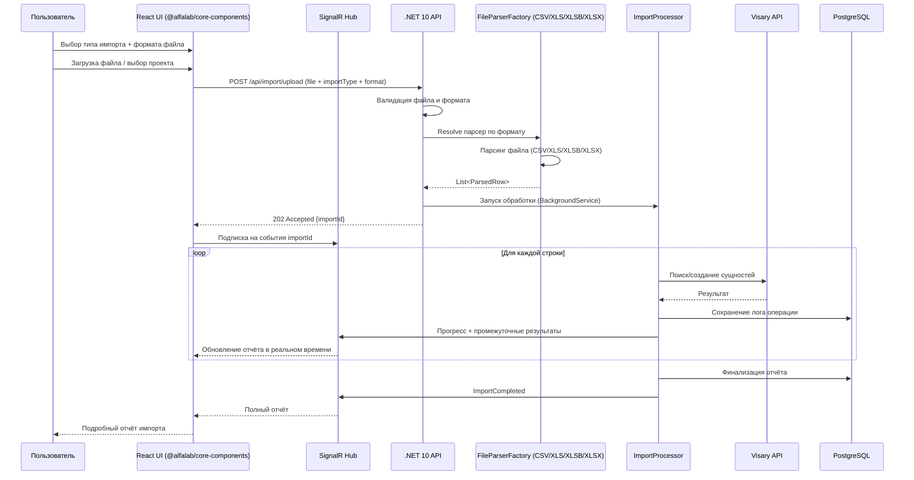
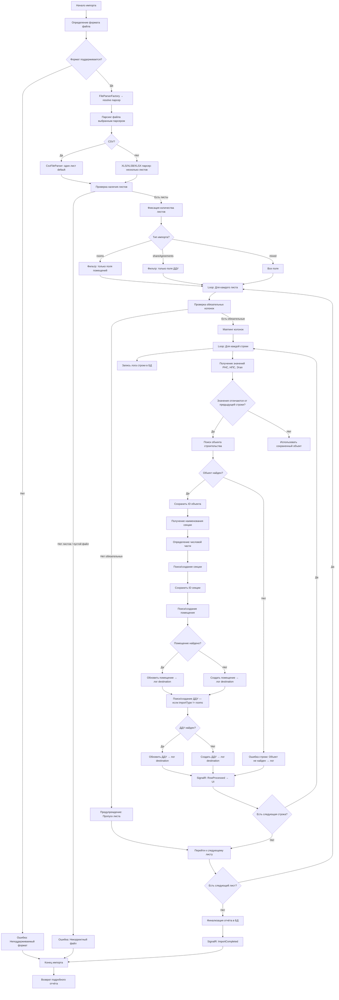
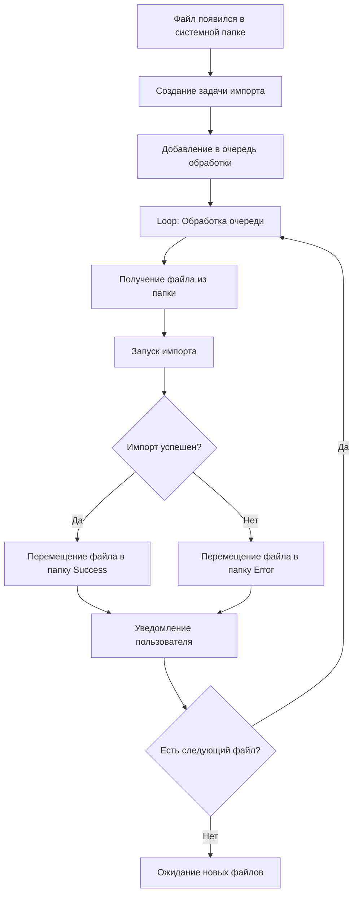

# План разработки сервиса импорта файлов

## 1. Обзор проекта

### 1.1 Назначение
Сервис для импорта данных из файлов различных форматов (CSV, XLS, XLSB, XLSX) в систему Visary (Альфа Банк - Управление проектами). Сервис обрабатывает файлы с данными о помещениях, ДДУ и связанных сущностях, создавая или обновляя записи в базе данных. Пользователь выбирает тип импорта и формат файла через UI, получает подробный отчёт о результатах.

### 1.2 Технологический стек
- **Backend**: .NET 10 Web API (C# 13)
- **Frontend**: React 18–19 + TypeScript 5+
- **UI-библиотека**: `@alfalab/core-components` (оригинальные компоненты Альфа-Банка)
- **База данных**: PostgreSQL 16+
- **Контейнеризация**: Docker / Docker Compose
- **Форматы файлов**: CSV (.csv), Excel (.xls), Excel Binary (.xlsb), Excel (.xlsx)
- **Аутентификация**: Bearer Token
- **Очереди/фон**: BackgroundService / Channel&lt;T&gt; (.NET)
- **Real-time**: SignalR (прогресс и отчёт в реальном времени)

---

## 2. Архитектура решения

### 2.1 Общая схема



### 2.2 Структура проекта

```
KiloImportService/
├── docker-compose.yml                    # Оркестрация: API + Web + PostgreSQL
├── Dockerfile.api                        # Multi-stage build для .NET 10 API
├── Dockerfile.web                        # Multi-stage build для React UI
├── src/
│   ├── KiloImportService.Api/            # Web API проект
│   │   ├── Controllers/
│   │   │   ├── ImportController.cs       # Загрузка файла, запуск/отмена импорта
│   │   │   ├── ImportReportController.cs # Получение подробного отчёта
│   │   │   ├── ListViewController.cs
│   │   │   └── FilesController.cs
│   │   ├── Hubs/
│   │   │   └── ImportProgressHub.cs      # SignalR hub: прогресс и отчёт
│   │   ├── Services/
│   │   │   ├── Parsing/                  # Strategy: парсеры по формату файла
│   │   │   │   ├── IFileParser.cs        # Общий интерфейс парсера
│   │   │   │   ├── FileParserFactory.cs  # Фабрика: выбор парсера по расширению
│   │   │   │   ├── CsvFileParser.cs      # Парсинг CSV (CsvHelper)
│   │   │   │   ├── XlsFileParser.cs      # Парсинг XLS (NPOI)
│   │   │   │   ├── XlsbFileParser.cs     # Парсинг XLSB (ExcelDataReader)
│   │   │   │   ├── XlsxFileParser.cs     # Парсинг XLSX (ClosedXML / EPPlus)
│   │   │   │   └── Models/
│   │   │   │       ├── ParsedRow.cs      # Универсальная строка (все форматы)
│   │   │   │       ├── ParsedSheet.cs
│   │   │   │       └── MappingConfig.cs
│   │   │   ├── Visary/
│   │   │   │   ├── IVisaryClient.cs
│   │   │   │   ├── VisaryClient.cs
│   │   │   │   └── Models/
│   │   │   │       ├── ConstructionProject.cs
│   │   │   │       ├── ConstructionSite.cs
│   │   │   │       ├── Room.cs
│   │   │   │       ├── RoomKind.cs
│   │   │   │       ├── ConstructionSection.cs
│   │   │   │       ├── ShareAgreement.cs
│   │   │   │       └── Organization.cs
│   │   │   ├── Import/
│   │   │   │   ├── IImportProcessor.cs
│   │   │   │   ├── ImportProcessor.cs
│   │   │   │   ├── ImportBackgroundService.cs  # BackgroundService + Channel<T>
│   │   │   │   └── Models/
│   │   │   │       ├── ImportResult.cs
│   │   │   │       ├── ImportWarning.cs
│   │   │   │       ├── ImportError.cs
│   │   │   │       └── ImportType.cs     # Enum: Rooms, ShareAgreements, Mixed...
│   │   │   └── Report/
│   │   │       ├── IImportReportService.cs
│   │   │       ├── ImportReportService.cs
│   │   │       └── Models/
│   │   │           ├── ImportReportRow.cs     # Одна строка отчёта
│   │   │           ├── ImportReportSummary.cs # Сводка
│   │   │           └── EntityDestination.cs   # Куда загружена строка
│   │   ├── Data/
│   │   │   ├── AppDbContext.cs            # EF Core context (PostgreSQL)
│   │   │   ├── Entities/
│   │   │   │   ├── ImportJob.cs           # Задание на импорт
│   │   │   │   ├── ImportLog.cs           # Построчный лог операций
│   │   │   │   └── ImportFile.cs          # Метаданные загруженного файла
│   │   │   └── Migrations/
│   │   ├── DTOs/
│   │   │   ├── Import/
│   │   │   │   ├── ImportRequest.cs       # + importType, fileFormat
│   │   │   │   ├── ImportResponse.cs
│   │   │   │   ├── ImportStatusDto.cs
│   │   │   │   └── ImportReportDto.cs     # Подробный отчёт для UI
│   │   │   └── ListView/
│   │   │       ├── ProjectItem.cs
│   │   │       └── SiteItem.cs
│   │   ├── appsettings.json
│   │   ├── appsettings.Docker.json
│   │   └── Program.cs
│   └── KiloImportService.Web/            # React UI проект
│       ├── src/
│       │   ├── components/
│       │   │   ├── ImportTypePicker/      # Выбор типа импорта
│       │   │   │   └── ImportTypePicker.tsx
│       │   │   ├── FileFormatPicker/      # Выбор формата файла
│       │   │   │   └── FileFormatPicker.tsx
│       │   │   ├── ImportForm/
│       │   │   │   ├── ImportForm.tsx
│       │   │   │   ├── ProjectSelect.tsx
│       │   │   │   ├── SiteSelect.tsx
│       │   │   │   └── DateRange.tsx
│       │   │   ├── FileUpload/
│       │   │   │   ├── FileUpload.tsx     # @alfalab/core-components-dropzone
│       │   │   │   └── FileList.tsx       # @alfalab/core-components-file-upload-item
│       │   │   └── ImportReport/          # Подробный отчёт
│       │   │       ├── ImportReport.tsx           # Контейнер отчёта
│       │   │       ├── ReportSummary.tsx          # Сводка: создано/обновлено/ошибки
│       │   │       ├── ReportTable.tsx            # Таблица построчных результатов
│       │   │       ├── ReportProgress.tsx         # Прогресс-бар в реальном времени
│       │   │       ├── ReportErrorList.tsx        # Список ошибок с фильтрацией
│       │   │       └── ReportWarningList.tsx      # Список предупреждений
│       │   ├── hooks/
│       │   │   ├── useImportProgress.ts   # SignalR подписка
│       │   │   └── useImportReport.ts     # Загрузка отчёта
│       │   ├── services/
│       │   │   ├── api.ts
│       │   │   ├── importService.ts
│       │   │   ├── reportService.ts
│       │   │   ├── signalrService.ts      # SignalR клиент
│       │   │   └── listViewService.ts
│       │   ├── types/
│       │   │   ├── import.ts
│       │   │   ├── report.ts
│       │   │   └── listView.ts
│       │   ├── App.tsx
│       │   └── main.tsx
│       └── package.json
├── tests/
│   ├── KiloImportService.Tests/
│   │   ├── Parsing/
│   │   │   ├── CsvFileParserTests.cs
│   │   │   ├── XlsFileParserTests.cs
│   │   │   ├── XlsbFileParserTests.cs
│   │   │   └── XlsxFileParserTests.cs
│   │   └── Import/
│   │       └── ImportProcessorTests.cs
│   └── KiloImportService.IntegrationTests/
├── test-files/                            # Тестовые файлы каждого формата
│   ├── sample.csv
│   ├── sample.xls
│   ├── sample.xlsb
│   └── sample.xlsx
└── docs/
    └── architecture.md
```

---

## 3. API спецификация

### 3.1 Список проектов (ListView)

**Endpoint**: `POST /api/listview/constructionproject`

**Описание**: Получение списка всех активных проектов

**Request**:
```json
{
  "filter": null,
  "skip": 0,
  "take": 100
}
```

**Response**:
```json
{
  "items": [
    {
      "id": 123,
      "title": "Проект 1",
      "code": "PRJ-001",
      "hidden": false
    }
  ],
  "totalCount": 1
}
```

### 3.2 Список объектов (ListView)

**Endpoint**: `POST /api/listview/constructionsite`

**Описание**: Получение списка объектов строительства с фильтрацией по проекту

**Request**:
```json
{
  "filter": {
    "field": "ConstructionProject",
    "operator": "=",
    "value": 123
  },
  "skip": 0,
  "take": 100
}
```

**Response**:
```json
{
  "items": [
    {
      "id": 456,
      "title": "Объект 1",
      "constructionPermissionNumber": "РНС-001",
      "constructionProjectNumber": "НПС-001",
      "stageNumber": "Этап 1",
      "hidden": false
    }
  ],
  "totalCount": 1
}
```

### 3.3 Загрузка файла для импорта

**Endpoint**: `POST /api/import/upload`

**Описание**: Загрузка файла для обработки. Пользователь выбирает тип импорта. Формат файла определяется автоматически по расширению на backend (см. `FileParserFactory`). Даты начала и окончания импорта фиксируются backend'ом автоматически (`startedAt` в момент принятия файла, `completedAt` при завершении обработки) и возвращаются в составе `ImportReport` как информационные поля (см. раздел 3.5).

**Request** (multipart/form-data):
```
file: <Файл (.csv | .xls | .xlsb | .xlsx)>
projectId: 123
siteId: 456
importType: "rooms"             # см. список ниже
```

**Допустимые значения `importType`** (список расширяемый):

| Значение | Описание |
|----------|----------|
| `rooms` | Импорт только помещений |
| `shareAgreements` | Импорт только ДДУ |
| `mixed` | Импорт помещений + ДДУ (полный цикл) |
| `paymentSchedule` | График платежей по ДДУ |
| `escrowAccounts` | Счета эскроу |
| `constructionSites` | Объекты строительства |
| `organizations` | Организации (застройщики) |
| `buyers` | Покупатели (физ. лица) |

> 📝 На UI список типов подтягивается через `GET /api/import/types` (или из статического реестра `IMPORT_TYPES` в прототипе). Формат и даты старта/завершения — **не** передаются клиентом.

**Response** (HTTP 202 Accepted):
```json
{
  "importId": "guid-123",
  "status": "Queued",
  "fileFormat": "xlsx",
  "importType": "mixed",
  "message": "Файл принят, обработка запущена. Подпишитесь на SignalR hub для получения прогресса."
}
```

### 3.4 Статус импорта

**Endpoint**: `GET /api/import/status/{importId}`

**Response**:
```json
{
  "importId": "guid-123",
  "status": "Processing",
  "importType": "mixed",
  "fileFormat": "xlsx",
  "progress": {
    "currentRow": 45,
    "totalRows": 100,
    "currentSheet": "Лист1",
    "percentComplete": 45
  },
  "summary": {
    "totalSheets": 1,
    "totalRows": 100,
    "roomsCreated": 20,
    "roomsUpdated": 5,
    "roomsSkipped": 0,
    "shareAgreementsCreated": 15,
    "shareAgreementsUpdated": 3,
    "shareAgreementsSkipped": 0,
    "errorsCount": 2,
    "warningsCount": 5
  }
}
```

### 3.5 Подробный отчёт импорта

**Endpoint**: `GET /api/import/{importId}/report`

**Описание**: Подробный отчёт по каждой строке: что было загружено, куда, с каким результатом.

**Query parameters**: `?page=1&pageSize=50&filter=errors|warnings|success|all`

**Response**:
```json
{
  "importId": "guid-123",
  "status": "Completed",
  "importType": "mixed",
  "fileFormat": "xlsx",
  "fileName": "import_2024-01-01.xlsx",
  "startedAt": "2024-01-15T10:00:00Z",
  "completedAt": "2024-01-15T10:02:35Z",
  "duration": "00:02:35",
  "summary": {
    "totalSheets": 2,
    "totalRows": 100,
    "roomsCreated": 50,
    "roomsUpdated": 10,
    "roomsSkipped": 5,
    "shareAgreementsCreated": 45,
    "shareAgreementsUpdated": 5,
    "shareAgreementsSkipped": 2,
    "errorsCount": 3,
    "warningsCount": 8
  },
  "rows": [
    {
      "rowNumber": 1,
      "sheet": "Лист1",
      "status": "success",
      "sourceData": {
        "roomNumber": "101",
        "rns": "РНС-001",
        "nps": "НПС-001",
        "stage": "Этап 1"
      },
      "destinations": [
        {
          "entity": "Room",
          "action": "Created",
          "entityId": 789,
          "entityTitle": "Помещение 101",
          "targetField": "ConstructionSite → Section → Room"
        },
        {
          "entity": "ShareAgreement",
          "action": "Created",
          "entityId": 1024,
          "entityTitle": "ДДУ-001 от 01.01.2024",
          "targetField": "Room → ShareAgreement"
        }
      ],
      "warnings": [],
      "errors": []
    },
    {
      "rowNumber": 25,
      "sheet": "Лист1",
      "status": "error",
      "sourceData": {
        "roomNumber": "205",
        "rns": "",
        "nps": "НПС-999",
        "stage": "Этап 1"
      },
      "destinations": [],
      "warnings": [
        { "field": "rns", "message": "Поле 'РНС' пустое, поиск по альтернативным полям" }
      ],
      "errors": [
        { "field": "constructionSite", "message": "Не найден объект строительства по НПС-999 + Этап 1" }
      ]
    }
  ],
  "pagination": {
    "page": 1,
    "pageSize": 50,
    "totalPages": 2,
    "totalItems": 100
  }
}
```

### 3.6 Загрузка файла из системной папки

**Endpoint**: `POST /api/import/from-folder`

**Описание**: Инициация обработки файла из системной папки проекта

**Request**:
```json
{
  "projectId": 123,
  "siteId": 456,
  "importType": "mixed",
  "folderPath": "C:\\Projects\\Project123\\Imports",
  "fileName": "import_2024-01-01.xlsx"
}
```

**Response**:
```json
{
  "importId": "guid-456",
  "status": "Queued",
  "message": "Файл добавлен в очередь обработки"
}
```

### 3.7 SignalR Hub — прогресс в реальном времени

**Hub URL**: `/hubs/import-progress`

**Серверные события (Server → Client)**:
| Событие | Payload | Описание |
|---------|---------|----------|
| `ProgressUpdated` | `{ importId, currentRow, totalRows, percentComplete }` | Обновление прогресса |
| `RowProcessed` | `{ importId, rowNumber, sheet, status, destinations }` | Результат обработки строки |
| `WarningAdded` | `{ importId, rowNumber, sheet, message }` | Новое предупреждение |
| `ErrorAdded` | `{ importId, rowNumber, sheet, message }` | Новая ошибка |
| `ImportCompleted` | `{ importId, summary, duration }` | Импорт завершён |

**Клиентские методы (Client → Server)**:
| Метод | Параметры | Описание |
|-------|-----------|----------|
| `SubscribeToImport` | `importId` | Подписка на события импорта |
| `UnsubscribeFromImport` | `importId` | Отписка |

---

## 4. Модели данных

### 4.1 Перечисления

```csharp
/// Тип импорта — что именно загружаем
public enum ImportType
{
    Rooms,              // Только помещения
    ShareAgreements,    // Только ДДУ
    Mixed               // Помещения + ДДУ (полный цикл)
}

/// Формат исходного файла
public enum FileFormat
{
    Csv,    // .csv
    Xls,    // .xls (Excel 97-2003)
    Xlsb,   // .xlsb (Excel Binary Workbook)
    Xlsx    // .xlsx (Excel 2007+)
}

/// Статус импорта
public enum ImportStatus
{
    Queued,
    Parsing,
    Processing,
    Completed,
    CompletedWithWarnings,
    Failed,
    Cancelled
}

/// Действие над сущностью
public enum EntityAction
{
    Created,
    Updated,
    Skipped,
    Error
}
```

### 4.2 ParsedRow — универсальная строка (все форматы)

```csharp
public class ParsedRow
{
    public int RowNumber { get; set; }
    public string SheetName { get; set; } = "default"; // Для CSV всегда "default"
    
    // Обязательные поля для поиска объекта
    public string? ConstructionPermissionNumber { get; set; } // РНС
    public string? ConstructionProjectNumber { get; set; }    // НПС
    public string? StageNumber { get; set; }                  // Этап
    
    // Поля для помещения
    public string? RoomNumber { get; set; }                   // Номер помещения
    public string? RoomKindTitle { get; set; }                // Вид помещения
    public string? BuildingSection { get; set; }              // Подъезд/Секция
    public string? Floor { get; set; }                        // Этаж
    public double? ProjectArea { get; set; }                  // Площадь
    public decimal? Cost { get; set; }                        // Стоимость
    
    // Поля для ДДУ
    public string? ShareAgreementNumber { get; set; }         // № ДДУ
    public DateTime? ShareAgreementDate { get; set; }         // Дата ДДУ
    public decimal? DepositedAmount { get; set; }             // Сумма депонирования
    public string? BuyerFullName { get; set; }                // ФИО покупателя
    public decimal? PaymentPercentage { get; set; }           // % оплаты
    
    // Сырые данные (для отчёта)
    public Dictionary<string, string?> RawValues { get; set; } = new();
}
```

### 4.3 ImportResult и ImportSummary

```csharp
public class ImportResult
{
    public Guid ImportId { get; set; }
    public ImportStatus Status { get; set; }
    public ImportType ImportType { get; set; }
    public FileFormat FileFormat { get; set; }
    public List<ImportWarning> Warnings { get; set; } = new();
    public List<ImportError> Errors { get; set; } = new();
    public ImportSummary Summary { get; set; } = new();
    public DateTime StartedAt { get; set; }
    public DateTime? CompletedAt { get; set; }
}

public class ImportSummary
{
    public int TotalSheets { get; set; }
    public int TotalRows { get; set; }
    public int RoomsCreated { get; set; }
    public int RoomsUpdated { get; set; }
    public int RoomsSkipped { get; set; }
    public int ShareAgreementsCreated { get; set; }
    public int ShareAgreementsUpdated { get; set; }
    public int ShareAgreementsSkipped { get; set; }
    public int ErrorsCount { get; set; }
    public int WarningsCount { get; set; }
}
```

### 4.4 Модели отчёта

```csharp
/// Строка подробного отчёта
public class ImportReportRow
{
    public int RowNumber { get; set; }
    public string Sheet { get; set; }
    public string Status { get; set; } // success | warning | error
    public Dictionary<string, string?> SourceData { get; set; } = new();
    public List<EntityDestination> Destinations { get; set; } = new();
    public List<ImportWarning> Warnings { get; set; } = new();
    public List<ImportError> Errors { get; set; } = new();
}

/// Куда загружена строка
public class EntityDestination
{
    public string Entity { get; set; }       // Room, ShareAgreement, Section...
    public EntityAction Action { get; set; } // Created, Updated, Skipped, Error
    public long? EntityId { get; set; }
    public string? EntityTitle { get; set; }
    public string? TargetField { get; set; } // Путь: ConstructionSite → Section → Room
}
```

### 4.5 Сущности БД (PostgreSQL)

```csharp
/// Задание на импорт
public class ImportJob
{
    public Guid Id { get; set; }
    public int ProjectId { get; set; }
    public int SiteId { get; set; }
    public ImportType ImportType { get; set; }
    public FileFormat FileFormat { get; set; }
    public ImportStatus Status { get; set; }
    public string FileName { get; set; }
    public long FileSizeBytes { get; set; }
    public string? UserId { get; set; }
    public DateTime CreatedAt { get; set; }
    public DateTime? StartedAt { get; set; }
    public DateTime? CompletedAt { get; set; }
    public int TotalRows { get; set; }
    public int ProcessedRows { get; set; }
    public string? ErrorMessage { get; set; }
    public List<ImportLog> Logs { get; set; } = new();
}

/// Построчный лог операций (для отчёта)
public class ImportLog
{
    public long Id { get; set; }
    public Guid ImportJobId { get; set; }
    public int RowNumber { get; set; }
    public string SheetName { get; set; }
    public string Status { get; set; }        // success | warning | error
    public string? Entity { get; set; }       // Room, ShareAgreement
    public EntityAction? Action { get; set; }
    public long? EntityId { get; set; }
    public string? EntityTitle { get; set; }
    public string? Message { get; set; }
    public string? SourceDataJson { get; set; } // JSON со значениями исходной строки
    public DateTime CreatedAt { get; set; }
}
```

### 4.6 Интерфейс парсера (Strategy Pattern)

```csharp
/// Общий интерфейс для парсеров всех форматов
public interface IFileParser
{
    FileFormat SupportedFormat { get; }
    Task<List<ParsedSheet>> ParseAsync(Stream fileStream, MappingConfig mapping, CancellationToken ct = default);
}

public class ParsedSheet
{
    public string Name { get; set; }
    public List<ParsedRow> Rows { get; set; } = new();
    public List<string> DetectedColumns { get; set; } = new();
    public bool HasRequiredColumns { get; set; }
}

/// Фабрика парсеров
public class FileParserFactory
{
    private readonly IEnumerable<IFileParser> _parsers;
    
    public FileParserFactory(IEnumerable<IFileParser> parsers) => _parsers = parsers;
    
    public IFileParser GetParser(FileFormat format) =>
        _parsers.FirstOrDefault(p => p.SupportedFormat == format)
        ?? throw new NotSupportedException($"Формат {format} не поддерживается");
    
    public IFileParser GetParser(string fileExtension) =>
        GetParser(ResolveFormat(fileExtension));
    
    public static FileFormat ResolveFormat(string extension) => extension.ToLowerInvariant() switch
    {
        ".csv"  => FileFormat.Csv,
        ".xls"  => FileFormat.Xls,
        ".xlsb" => FileFormat.Xlsb,
        ".xlsx" => FileFormat.Xlsx,
        _ => throw new NotSupportedException($"Расширение {extension} не поддерживается")
    };
}
```

---

## 5. Алгоритм обработки файлов

### 5.1 Общий процесс (все форматы)



### 5.2 Поиск объекта строительства

Алгоритм поиска объекта строительства (из схемы `room_sa_create.puml`):

1. **Попытка 1**: РНС + Этап
2. **Попытка 2**: РНС + НПС + Этап
3. **Попытка 3**: НПС + Этап

Если объект найден по ПИНу застройщика, организация привязывается к объекту.

### 5.3 Поиск/создание секции

- **Поиск**: По наименованию секции (числовая часть)
- **Создание**: Если не найдена, создается секция с типом "Жилой корпус"
- **Примечание**: Тип секции определяется по наименованию (например, "Жилая", "Коммерческая")

### 5.4 Поиск/создание помещения

**Поля для поиска**:
- ID секции (из предыдущего шага)
- Номер помещения
- Вид помещения
- Подъезд

**Обновление**: Помещение обновляется, если найдено по уникальным полям.

### 5.5 Поиск/создание ДДУ

**Поля для поиска**:
- ID помещения (из предыдущего шага)
- № ДДУ

**Обновление**: Обновляется только сумма депонирования.

---

## 6. UI компоненты (@alfalab/core-components)

> Все UI-компоненты строятся на базе библиотеки [`@alfalab/core-components`](https://github.com/alfa-laboratory/core-components).
> Установка: `yarn add @alfalab/core-components` или отдельными пакетами.

### 6.1 Маппинг Alfa-компонентов на UI-элементы

| UI-элемент | Alfa-компонент | Пакет |
|------------|---------------|-------|
| Выбор типа импорта | `RadioGroup` + `Radio` | `@alfalab/core-components-radio-group` |
| Выбор формата файла | `Tabs` | `@alfalab/core-components-tabs` |
| Drag & drop загрузка | `Dropzone` | `@alfalab/core-components-dropzone` |
| Элемент загруженного файла | `FileUploadItem` | `@alfalab/core-components-file-upload-item` |
| Выбор проекта/объекта | `Select` | `@alfalab/core-components-select` |
| Ввод дат | `CalendarInput` / `CalendarRange` | `@alfalab/core-components-calendar-input` |
| Кнопки действий | `Button` | `@alfalab/core-components-button` |
| Прогресс-бар импорта | `ProgressBar` | `@alfalab/core-components-progress-bar` |
| Спиннер загрузки | `Spinner` / `Loader` | `@alfalab/core-components-spinner` |
| Таблица отчёта | `Table` | `@alfalab/core-components-table` |
| Пагинация отчёта | `Pagination` | `@alfalab/core-components-pagination` |
| Уведомления (toast) | `Notification` + `NotificationManager` | `@alfalab/core-components-notification` |
| Предупреждения/ошибки | `Alert` | `@alfalab/core-components-alert` |
| Бейджи статусов | `Badge` / `Status` | `@alfalab/core-components-badge` |
| Тултипы | `Tooltip` | `@alfalab/core-components-tooltip` |
| Типографика | `Typography` | `@alfalab/core-components-typography` |
| Модальные окна | `Modal` | `@alfalab/core-components-modal` |
| Сетка | `Grid` | `@alfalab/core-components-grid` |
| Теги фильтрации | `FilterTag` / `Tag` | `@alfalab/core-components-filter-tag` |
| Коллапс/аккордеон | `Collapse` | `@alfalab/core-components-collapse` |
| Разделители | `Divider` | `@alfalab/core-components-divider` |

### 6.2 Компонент выбора типа импорта

**Компонент**: `ImportTypePicker.tsx`

**Описание**: Первый шаг — пользователь выбирает, что именно импортировать. Поскольку типов может быть 5+ (расширяемый список), используется `Select`, а не `RadioGroup`.

```tsx
import { Select } from '@alfalab/core-components/select';
import { IMPORT_TYPES } from '../mocks/importTypes';

// Select с опциями из IMPORT_TYPES:
// - "rooms"            → Помещения
// - "shareAgreements"  → ДДУ (Договоры долевого участия)
// - "mixed"            → Помещения + ДДУ (полный цикл)
// - "paymentSchedule"  → График платежей по ДДУ
// - "escrowAccounts"   → Счета эскроу
// - ... (список расширяемый, см. раздел 3.3)
```

**Почему `Select`, а не `RadioGroup`**:
- Типов импорта >5 (текущий минимум — 8), список расширяется
- `RadioGroup` при большом списке переполняет форму
- `Select` встроенно поддерживает поиск / фильтрацию

### 6.3 Компонент формы импорта

**Компонент**: `ImportForm.tsx`

**Поля** (с использованием Alfa-компонентов):

1. **Тип импорта** — `Select`
   - Список подгружается через `GET /api/import/types` (или из статического реестра `IMPORT_TYPES` в прототипе)
   - 8+ типов (расширяемый список), см. раздел 3.3
   - Обязательное поле
2. **Проект** — `Select`
   - Загрузка: `POST /api/listview/constructionproject`
   - Обязательное поле
3. **Объект** — `Select`
   - Загрузка: `POST /api/listview/constructionsite?filter=...`
   - Зависит от выбора проекта
   - Обязательное поле
4. **Загрузка файла** — `Dropzone` + `FileUploadItem`
   - Формат определяется **автоматически** по расширению (`detectFileFormat`)
   - Accept — все поддерживаемые форматы (CSV, XLS, XLSB, XLSX)
   - Под загруженным файлом — бейдж определённого формата (`Status`)
5. **Кнопка "Запустить импорт"** — `Button` (view="primary")
   - Активна только при заполненных обязательных полях и загруженном файле с поддерживаемым расширением

> 📝 **Нет отдельного выбора формата файла** — он резолвится автоматически (UI-компонент `FileFormatPicker` удалён).
>
> 📝 **Нет полей «Дата начала» / «Дата окончания» импорта** — это информационные поля, фиксируются backend'ом автоматически и отображаются в отчёте (см. раздел 6.5.2).

### 6.4 Компонент загрузки файла

**Компонент**: `FileUpload.tsx`

```tsx
import { Dropzone } from '@alfalab/core-components/dropzone';
import { FileUploadItem } from '@alfalab/core-components/file-upload-item';
import { Status } from '@alfalab/core-components/status';
```

**Функционал**:
- `Dropzone` — Drag & drop зона, `accept` включает все поддерживаемые форматы
- Автоматическое определение формата по расширению (утилита `detectFileFormat`)
- Если расширение не поддерживается — ошибка под Dropzone, файл не принимается
- `FileUploadItem` — отображение загруженного файла с именем и размером
- `Status` (синий, soft) — бейдж определённого формата под файлом («XLSX», «CSV», и т.д.)
- Ограничение размера файла (настраивается, по умолчанию 50 МБ)

### 6.5 Компонент подробного отчёта импорта

**Компонент**: `ImportReport.tsx` (контейнер)

**Подкомпоненты**:

#### 6.5.1 `ReportProgress.tsx` — прогресс в реальном времени
```tsx
import { ProgressBar } from '@alfalab/core-components-progress-bar';
import { Typography } from '@alfalab/core-components-typography';
// Отображает: прогресс-бар + "45 из 100 строк (45%)" + текущий лист
// Данные приходят через SignalR (useImportProgress hook)
```

#### 6.5.2 `ReportSummary.tsx` — сводка результатов
```tsx
import { Typography } from '@alfalab/core-components/typography';
import { formatDateTime } from '../utils/datetime';  // утилита форматирования DateTime
```

**Информационный блок (фиксируется backend'ом, read-only)**:

| Поле | Тип данных | Источник |
|------|------------|----------|
| **Начало импорта** | `DateTime` — `DD.MM.YYYY HH:mm:ss` | `ImportReport.startedAt` (ISO 8601 с сервера) |
| **Окончание импорта** | `DateTime` — `DD.MM.YYYY HH:mm:ss` | `ImportReport.completedAt` (ISO 8601) |
| **Длительность** | `HH:mm:ss` | `ImportReport.duration` (сервер считает как `completedAt - startedAt`) |

> 📝 Эти поля **информационные** — не вводятся пользователем. Backend фиксирует `startedAt` в момент принятия файла (`POST /api/import/upload`), `completedAt` — в момент завершения обработки. На UI выводятся через утилиту `formatDateTime(iso)` из ISO-формата сервера в формат `DD.MM.YYYY HH:mm:ss`.

**Метрики (карточки)**:
- **Всего строк** — общее количество
- **Помещений создано** / **обновлено** / **пропущено**
- **ДДУ создано** / **обновлено** / **пропущено**
- **Ошибок** / **Предупреждений**

**Заголовок отчёта**: `{fileName} · {fileFormat.toUpperCase()} · Тип: {importType label из IMPORT_TYPES}`

#### 6.5.3 `ReportTable.tsx` — построчный отчёт
```tsx
import { Table } from '@alfalab/core-components-table';
import { Pagination } from '@alfalab/core-components-pagination';
import { FilterTag } from '@alfalab/core-components-filter-tag';
import { Status } from '@alfalab/core-components-status';
import { Collapse } from '@alfalab/core-components-collapse';
import { Tooltip } from '@alfalab/core-components-tooltip';
```

**Колонки таблицы**:
| Колонка | Описание |
|---------|----------|
| № строки | Номер строки в исходном файле |
| Лист | Название листа (для CSV — "default") |
| Статус | `Status` компонент: ✅ success / ⚠️ warning / ❌ error |
| Исходные данные | Ключевые поля из исходной строки (РНС, номер помещения и т.д.) |
| Назначение | Куда загружено: сущность → действие (Created/Updated) |
| Подробности | `Collapse` — раскрываемый блок с полным списком полей и ошибок |

**Фильтрация**:
- `FilterTag` — быстрые фильтры: Все / Успешные / С предупреждениями / С ошибками
- Пагинация: `Pagination` (50 строк на странице)

#### 6.6.4 `ReportErrorList.tsx` и `ReportWarningList.tsx`
```tsx
import { Alert } from '@alfalab/core-components-alert';
import { Collapse } from '@alfalab/core-components-collapse';
```
- Сгруппированные ошибки/предупреждения
- Каждый `Alert` содержит: номер строки, лист, поле, сообщение
- Возможность свернуть/развернуть список

---

## 7. Обработка файлов из системной папки

### 7.1 Алгоритм



### 7.2 Структура папок

```
C:\Projects\Project123\Imports\
├── Pending\          # Файлы для обработки
├── Success\          # Успешно обработанные файлы
├── Error\            # Файлы с ошибками
└── Processing\       # Файлы в процессе обработки
```

### 7.3 Очередь обработки

Очередь реализуется через `ImportJob` (см. раздел 4.5) со статусом `Queued`. Фоновый сервис `ImportBackgroundService` читает задания из `Channel<ImportJobRequest>` и обрабатывает последовательно.

---

## 8. Docker

### 8.1 docker-compose.yml

```yaml
version: '3.9'

services:
  api:
    build:
      context: .
      dockerfile: Dockerfile.api
    ports:
      - "5000:8080"
    environment:
      - ASPNETCORE_ENVIRONMENT=Docker
      - ConnectionStrings__DefaultConnection=Host=db;Database=kilo_import;Username=postgres;Password=postgres
      - VisaryApi__BaseUrl=https://visary-api.example.com
    depends_on:
      db:
        condition: service_healthy
    volumes:
      - import-files:/app/imports

  web:
    build:
      context: .
      dockerfile: Dockerfile.web
    ports:
      - "3000:80"
    environment:
      - REACT_APP_API_URL=http://localhost:5000
    depends_on:
      - api

  db:
    image: postgres:16-alpine
    environment:
      POSTGRES_DB: kilo_import
      POSTGRES_USER: postgres
      POSTGRES_PASSWORD: postgres
    ports:
      - "5432:5432"
    volumes:
      - pgdata:/var/lib/postgresql/data
    healthcheck:
      test: ["CMD-SHELL", "pg_isready -U postgres"]
      interval: 5s
      timeout: 5s
      retries: 5

volumes:
  pgdata:
  import-files:
```

### 8.2 Dockerfile.api (multi-stage)

```dockerfile
FROM mcr.microsoft.com/dotnet/sdk:10.0 AS build
WORKDIR /src
COPY src/KiloImportService.Api/ ./KiloImportService.Api/
RUN dotnet restore KiloImportService.Api/KiloImportService.Api.csproj
RUN dotnet publish KiloImportService.Api/KiloImportService.Api.csproj -c Release -o /app/publish

FROM mcr.microsoft.com/dotnet/aspnet:10.0 AS runtime
WORKDIR /app
COPY --from=build /app/publish .
EXPOSE 8080
ENTRYPOINT ["dotnet", "KiloImportService.Api.dll"]
```

### 8.3 Dockerfile.web (multi-stage)

```dockerfile
FROM node:20-alpine AS build
WORKDIR /app
COPY src/KiloImportService.Web/package.json src/KiloImportService.Web/yarn.lock ./
RUN yarn install --frozen-lockfile
COPY src/KiloImportService.Web/ .
RUN yarn build

FROM nginx:alpine AS runtime
COPY --from=build /app/dist /usr/share/nginx/html
COPY nginx.conf /etc/nginx/conf.d/default.conf
EXPOSE 80
```

### 8.4 Команды запуска

```bash
# Запуск всего стека
docker compose up -d

# Только перестроить API
docker compose up -d --build api

# Просмотр логов
docker compose logs -f api

# Остановка
docker compose down
```

---

## 9. Валидация и обработка ошибок

### 9.1 Валидация файлов (все форматы)

**Обязательные колонки** (из маппинга):
- РНС (Номер разрешения)
- НПС (Номер проекта)
- Этап
- Номер помещения/Квартира
- Тип/Название/Вид
- № стр/корп
- Этаж
- Подъезд/Секция
- Колич. комнат
- Площадь
- Стоимость кв.м
- Скидка на опт
- Рыночная стоимость
- Залоговая стоимость
- Вывод (да/нет)
- Стоимость ДКП
- Сумма депонирования
- Сумма на эскроу
- За кв.м. по ДДУ
- Дата ДДУ
- № ДДУ
- ФИО покупателя
- % оплаты

**Предупреждения**:
- Отсутствие обязательных колонок
- Пустые значения в обязательных полях
- Несоответствие форматов данных

**Ошибки**:
- Некорректный формат файла
- Отсутствие листов
- Не найден объект строительства
- Не найдена секция

### 9.2 Обработка ошибок

```csharp
public class ImportError
{
    public int Row { get; set; }
    public string Sheet { get; set; }
    public string Field { get; set; }
    public string Message { get; set; }
    public string? SuggestedValue { get; set; }
}
```

---

## 10. Интеграция с Visary API

### 10.1 Методы Visary API

**Получение списка проектов**:
```
POST /api/listview/constructionproject
```

**Получение списка объектов**:
```
POST /api/listview/constructionsite
Body: { "filter": { "field": "ConstructionProject", "operator": "=", "value": 123 } }
```

**Поиск/создание объекта строительства**:
```
POST /api/constructionsite/find-or-create
Body: {
  "constructionPermissionNumber": "РНС-001",
  "constructionProjectNumber": "НПС-001",
  "stageNumber": "Этап 1"
}
```

**Поиск/создание секции**:
```
POST /api/constructionsection/find-or-create
Body: {
  "title": "Лит 1.1",
  "typeId": 1,
  "stage": 1
}
```

**Поиск/создание помещения**:
```
POST /api/room/find-or-create
Body: {
  "sectionId": 456,
  "number": "101",
  "kindId": 1,
  "buildingSection": "1",
  "floor": "1"
}
```

**Поиск/создание ДДУ**:
```
POST /api/shareagreement/find-or-create
Body: {
  "roomId": 789,
  "number": "ДДУ-001",
  "date": "2024-01-01",
  "depositedAmount": 1000000
}
```

---

## 11. Конфигурация

### 11.1 appsettings.json

```json
{
  "ConnectionStrings": {
    "DefaultConnection": "Host=localhost;Database=kilo_import;Username=postgres;Password=postgres"
  },
  "VisaryApi": {
    "BaseUrl": "https://visary-api.example.com",
    "AccessToken": "your-access-token"
  },
  "Import": {
    "DefaultFolderPath": "C:\\Projects",
    "SuccessFolder": "Success",
    "ErrorFolder": "Error",
    "ProcessingFolder": "Processing",
    "MaxConcurrentImports": 5,
    "MaxFileSizeMb": 50,
    "SupportedFormats": ["csv", "xls", "xlsb", "xlsx"]
  },
  "Parsing": {
    "DefaultSheetName": "Реестр",
    "StartRow": 5,
    "Csv": {
      "Delimiter": ";",
      "Encoding": "utf-8",
      "HasHeader": true
    },
    "Mapping": {
      "ConstructionPermissionNumber": "Номер разрешения",
      "ConstructionProjectNumber": "Номер проекта",
      "StageNumber": "Этап",
      "RoomNumber": "Номер помещения/Квартира",
      "RoomKindTitle": "Тип/Название/Вид",
      "BuildingSection": "Подъезд/Секция",
      "Floor": "Этаж",
      "ProjectArea": "Площадь",
      "Cost": "Стоимость",
      "ShareAgreementNumber": "№ ДДУ",
      "ShareAgreementDate": "Дата ДДУ",
      "DepositedAmount": "Сумма депонирования"
    }
  }
}
```

---

## 12. Тестирование

### 12.1 Unit тесты

- `CsvFileParserTests.cs` — парсинг CSV (разделители, кодировки, edge-cases)
- `XlsFileParserTests.cs` — парсинг XLS (старый формат)
- `XlsbFileParserTests.cs` — парсинг XLSB (бинарный формат)
- `XlsxFileParserTests.cs` — парсинг XLSX
- `FileParserFactoryTests.cs` — резолвинг парсера по расширению
- `ImportProcessorTests.cs` — логика импорта по типам (rooms / shareAgreements / mixed)
- `VisaryClientTests.cs` — тесты интеграции с Visary API
- `ImportReportServiceTests.cs` — формирование отчёта

### 12.2 Integration тесты

- `ImportControllerTests.cs` — тесты API endpoints (upload, status, report)
- `FileProcessingTests.cs` — полный цикл обработки для каждого формата
- `SignalRIntegrationTests.cs` — проверка прогресса через SignalR

---

## 13. Развертывание

### 13.1 Требования

- .NET 10 SDK
- Node.js 20+
- PostgreSQL 16+
- Docker / Docker Compose (рекомендуется)

### 13.2 Локальная разработка

```bash
# Запуск PostgreSQL через Docker
docker compose up -d db

# Миграции
dotnet ef database update --project src/KiloImportService.Api

# Build & Run API
dotnet run --project src/KiloImportService.Api

# Build & Run Web
cd src/KiloImportService.Web
yarn install
yarn dev
```

### 13.3 Продакшен (Docker)

```bash
docker compose up -d --build
```

---

## 14. Приоритеты разработки

### Фаза 1: Инфраструктура и парсинг (5 дней)
1. Создание проекта .NET 10 Web API + Docker Compose + PostgreSQL
2. EF Core контекст, миграции, сущности `ImportJob` / `ImportLog`
3. Реализация `IFileParser` + `FileParserFactory` (Strategy Pattern)
4. Парсеры: `XlsxFileParser` (основной), `CsvFileParser`
5. Unit тесты парсеров

### Фаза 2: Основная логика импорта (7 дней)
1. Реализация API endpoints для ListView (проекты, объекты)
2. Интеграция с Visary API (`IVisaryClient`)
3. Алгоритм поиска объекта строительства (3 попытки)
4. Поиск/создание секции, помещения, ДДУ
5. `ImportProcessor` + `ImportBackgroundService` (Channel&lt;T&gt;)
6. Запись построчного лога в БД (`ImportLog`)

### Фаза 3: UI + отчёт + SignalR (7 дней)
1. React UI на `@alfalab/core-components`
2. `ImportTypePicker` + `FileFormatPicker` + `ImportForm`
3. `FileUpload` (Dropzone + FileUploadItem)
4. SignalR Hub (`ImportProgressHub`) + хук `useImportProgress`
5. Компонент `ImportReport` (сводка, таблица, фильтры, пагинация)
6. Реализация endpoint `/api/import/{id}/report`

### Фаза 4: Дополнительные парсеры и функции (4 дня)
1. Парсеры: `XlsFileParser` (NPOI), `XlsbFileParser` (ExcelDataReader)
2. Обработка файлов из системной папки
3. Уведомления (`NotificationManager`)
4. E2E тесты основных сценариев

---

## 15. Сроки разработки

| Фаза | Задачи | Оценка |
|------|--------|--------|
| 1 | Инфраструктура и парсинг | 5 дней |
| 2 | Основная логика импорта | 7 дней |
| 3 | UI + отчёт + SignalR | 7 дней |
| 4 | Дополнительные парсеры и функции | 4 дня |
| **Итого** | | **23 дня** |

---

## 16. Дополнительные требования для ИИ агента

### 16.1 Роли и ответственности

| Роль | Ответственность | Ключевые задачи |
|------|-----------------|-----------------|
| **Backend Developer** | Разработка .NET 10 Web API | Создание контроллеров, сервисов, интеграция с Visary API, обработка Excel файлов |
| **Frontend Developer** | Разработка React UI | Создание компонентов формы импорта, загрузки файлов, отображения результатов |
| **DevOps Engineer** | Развертывание и поддержка | Настройка CI/CD, конфигурация сервера, мониторинг |

### 16.2 Критерии готовности (Definition of Done)

Для каждой фазы разработки должны быть выполнены следующие критерии:

**Фаза 1: Инфраструктура и парсинг**
- [ ] Создан проект .NET 10 Web API + Docker Compose + PostgreSQL
- [ ] EF Core контекст, миграции, сущности `ImportJob` / `ImportLog`
- [ ] Реализованы `IFileParser`, `FileParserFactory` (Strategy Pattern)
- [ ] Реализованы парсеры: `XlsxFileParser`, `CsvFileParser`
- [ ] Unit тесты парсеров для каждого формата
- [ ] Документация API через Swagger

**Фаза 2: Основная логика импорта**
- [ ] API endpoints для ListView (проекты, объекты)
- [ ] Интеграция с Visary API (`IVisaryClient`)
- [ ] Алгоритм поиска объекта строительства (3 попытки)
- [ ] Поиск/создание секции, помещения, ДДУ
- [ ] `ImportProcessor` + `ImportBackgroundService`
- [ ] Построчный лог операций в `ImportLog`
- [ ] Integration тесты

**Фаза 3: UI + отчёт + SignalR**
- [ ] React UI на `@alfalab/core-components`
- [ ] `ImportTypePicker` (выбор типа импорта)
- [ ] `FileFormatPicker` (выбор формата файла)
- [ ] `FileUpload` (Dropzone + FileUploadItem)
- [ ] SignalR Hub + `useImportProgress` хук
- [ ] `ImportReport` — подробный отчёт (таблица, сводка, фильтры)
- [ ] Endpoint `GET /api/import/{id}/report`
- [ ] UI протестирован в браузере

**Фаза 4: Дополнительные парсеры и функции**
- [ ] Парсеры: `XlsFileParser` (NPOI), `XlsbFileParser` (ExcelDataReader)
- [ ] Обработка файлов из системной папки
- [ ] Уведомления через `NotificationManager`
- [ ] E2E тесты основных сценариев

### 16.3 Технические требования к коду

**Backend (.NET 10)**
- Использовать C# 13 с современными практиками
- Применять Dependency Injection для всех сервисов
- Использовать IHttpClientFactory для Visary API
- Реализовать логирование через ILogger
- Применять обработку исключений через middleware
- Использовать async/await для всех асинхронных операций
- Регистрировать парсеры через DI (`services.AddScoped<IFileParser, XlsxFileParser>()` и т.д.)
- Использовать `Channel<T>` для внутренней очереди фоновых задач
- Npgsql.EntityFrameworkCore.PostgreSQL для PostgreSQL

**Frontend (React 18–19)**
- Использовать TypeScript 5+ с строгой типизацией
- Применять React Hooks для управления состоянием
- Использовать Axios для HTTP запросов
- `@microsoft/signalr` — клиент SignalR для прогресса
- **UI-библиотека**: `@alfalab/core-components` (без Tailwind / Material UI)
- Стилизация: CSS Modules / CSS Variables из `@alfalab/core-components-vars`

### 16.4 Стандарты именования

**Backend**
- Классы: PascalCase (например, `ExcelProcessor`, `ImportResult`)
- Интерфейсы: I + PascalCase (например, `IExcelProcessor`, `IVisaryClient`)
- Методы: PascalCase (например, `ProcessExcelFile`, `FindConstructionSite`)
- Поля: camelCase (например, `constructionPermissionNumber`)
- Константы: UPPER_SNAKE_CASE (например, `DEFAULT_SHEET_NAME`)

**Frontend**
- Компоненты: PascalCase (например, `ImportForm`, `FileUpload`)
- Функции: camelCase (например, `handleFileUpload`, `fetchProjects`)
- Переменные: camelCase (например, `projectId`, `importStatus`)
- Константы: UPPER_SNAKE_CASE (например, `API_BASE_URL`)

### 16.5 Структура конфигурации

См. раздел **11. Конфигурация** для полного `appsettings.json`.

### 16.6 Требования к тестированию

**Unit тесты**
- Покрытие кода тестами: не менее 80%
- Использовать xUnit или NUnit
- Мокать внешние зависимости через Moq

**Integration тесты**
- Тестировать полный цикл импорта
- Проверять корректность вызовов Visary API
- Проверять обработку ошибок

**E2E тесты**
- Тестировать полный пользовательский сценарий
- Использовать Playwright или Cypress

### 16.7 Требования к документации

**Код**
- Каждый публичный метод должен иметь XML комментарии
- Комментарии должны описывать параметры, возвращаемое значение и возможные исключения

**Архитектура**
- Диаграммы классов для основных компонентов
- Диаграммы последовательности для ключевых сценариев
- Описание алгоритмов поиска и сопоставления данных

**API**
- Swagger/OpenAPI спецификация
- Примеры запросов и ответов для каждого endpoint
- Описание ошибок и кодов статусов

### 16.8 Ключевые алгоритмы для реализации

**Алгоритм поиска объекта строительства**
```csharp
public async Task<ConstructionSite?> FindConstructionSiteAsync(string? rns, string? nps, string? stage)
{
    // Попытка 1: РНС + Этап
    if (!string.IsNullOrEmpty(rns) && !string.IsNullOrEmpty(stage))
    {
        var result = await FindByRnsAndStageAsync(rns, stage);
        if (result != null) return result;
    }

    // Попытка 2: РНС + НПС + Этап
    if (!string.IsNullOrEmpty(rns) && !string.IsNullOrEmpty(nps) && !string.IsNullOrEmpty(stage))
    {
        var result = await FindByRnsNpsAndStageAsync(rns, nps, stage);
        if (result != null) return result;
    }

    // Попытка 3: НПС + Этап
    if (!string.IsNullOrEmpty(nps) && !string.IsNullOrEmpty(stage))
    {
        var result = await FindByNpsAndStageAsync(nps, stage);
        if (result != null) return result;
    }

    return null;
}
```

**Алгоритм определения типа секции**
```csharp
public SectionType DetermineSectionType(string title)
{
    var lowerTitle = title.ToLower();
    
    if (lowerTitle.Contains("жил") || lowerTitle.Contains("жилая")) 
        return SectionType.Residential;
    if (lowerTitle.Contains("коммерч") || lowerTitle.Contains("офис")) 
        return SectionType.Commercial;
    if (lowerTitle.Contains("паркинг") || lowerTitle.Contains("машиномест")) 
        return SectionType.Parking;
    
    return SectionType.Residential; // По умолчанию
}
```

**Алгоритм извлечения числовой части**
```csharp
public string ExtractNumericPart(string title)
{
    // Удалить все нечисловые символы, кроме точки и цифр
    var numericPart = new string(title.Where(c => char.IsDigit(c) || c == '.').ToArray());
    return numericPart;
}
```

### 16.9 Чеклист для запуска в продакшен

**Подготовка**
- [ ] Созданы все необходимые таблицы в БД
- [ ] Настроен доступ к Visary API
- [ ] Созданы папки для обработки файлов
- [ ] Настроены переменные окружения

**Тестирование**
- [ ] Протестированы все API endpoints
- [ ] Протестирован импорт тестового файла
- [ ] Проверена обработка ошибок
- [ ] Проверена производительность

**Документация**
- [ ] Обновлена документация API
- [ ] Создано руководство пользователя
- [ ] Создано руководство администратора

**Мониторинг**
- [ ] Настроено логирование
- [ ] Настроены алерты
- [ ] Созданы дашборды

### 16.10 Часто задаваемые вопросы (FAQ)

**Вопрос**: Как обрабатывать файлы с несколькими листами?
**Ответ**: Каждый лист обрабатывается отдельно. Если лист не содержит обязательных колонок, он пропускается с предупреждением.

**Вопрос**: Что делать, если объект строительства не найден?
**Ответ**: Создается предупреждение, и обработка продолжается для следующей строки. Объект можно создать вручную в Visary и повторить импорт.

**Вопрос**: Как обновляются существующие данные?
**Ответ**: Помещение обновляется, если найдено по уникальным полям. ДДУ обновляется только сумма депонирования.

**Вопрос**: Можно ли отменить импорт?
**Ответ**: Да, импорт можно отменить до начала обработки. В процессе обработки отмена возможна, но уже обработанные данные не откатываются.

**Вопрос**: Какие форматы дат поддерживаются?
**Ответ**: Форматы дат: dd.MM.yyyy, yyyy-MM-dd, dd/MM/yyyy. Рекомендуется использовать формат dd.MM.yyyy.

**Вопрос**: Какие форматы файлов поддерживаются?
**Ответ**: CSV (.csv), Excel 97-2003 (.xls), Excel Binary (.xlsb), Excel 2007+ (.xlsx). Формат определяется автоматически по расширению файла. Для каждого формата используется отдельный парсер через Strategy Pattern.

**Вопрос**: Чем отличаются типы импорта?
**Ответ**: `rooms` — импорт только помещений (секции, этажи, площади). `shareAgreements` — только ДДУ (номер, дата, сумма). `mixed` — полный цикл: помещения + ДДУ. Тип импорта влияет на набор обязательных колонок и логику обработки.

**Вопрос**: Как работает отчёт импорта?
**Ответ**: Каждая строка файла логируется в таблицу `ImportLog` с результатом: куда загружена (сущность, действие, ID), ошибки, предупреждения. Отчёт доступен через API (`GET /api/import/{id}/report`) с пагинацией и фильтрацией. В UI отчёт обновляется в реальном времени через SignalR.

**Вопрос**: Как обрабатываются CSV файлы?
**Ответ**: CSV файлы обрабатываются как один «лист» с именем `default`. Разделитель настраивается в `Parsing.Csv.Delimiter` (по умолчанию `;`). Кодировка — `utf-8`.

### 16.11 Список зависимостей

**Backend (.NET 10)**
- Microsoft.AspNetCore.OpenApi
- Microsoft.AspNetCore.SignalR — real-time прогресс
- Microsoft.EntityFrameworkCore
- Microsoft.EntityFrameworkCore.Design
- Microsoft.EntityFrameworkCore.Tools
- Npgsql.EntityFrameworkCore.PostgreSQL — провайдер PostgreSQL
- Microsoft.Extensions.Http
- ClosedXML — парсинг XLSX
- NPOI — парсинг XLS
- ExcelDataReader — парсинг XLSB
- CsvHelper — парсинг CSV
- Swashbuckle.AspNetCore

**Frontend (React 18–19)**
- react / react-dom
- typescript
- @alfalab/core-components — UI-библиотека Альфа-Банка
- @alfalab/core-components-vars — CSS-переменные / темизация
- @microsoft/signalr — клиент SignalR
- axios
- @tanstack/react-query

**Контейнеризация**
- Docker / Docker Compose

**База данных**
- PostgreSQL 16+

### 16.12 Ключевые метрики успеха

- Время обработки файла: не более 5 минут на 1000 строк
- Точность импорта: не менее 95%
- Количество ошибок: не более 5% от общего количества строк
- Время отклика UI: не более 2 секунд
- Покрытие тестами: не менее 80%

### 16.13 План улучшений после MVP

**Фаза 5: Оптимизация**
1. Кэширование результатов поиска (объектов строительства, секций) — `IMemoryCache`
2. Batch-обработка: группировка строк по объекту → пакетные запросы к Visary API
3. Параллельная обработка нескольких листов (`Parallel.ForEachAsync`)
4. Streaming-парсинг для больших CSV (без загрузки в память целиком)

**Фаза 6: Расширение функциональности**
1. Импорт из других источников (API, прямое подключение к БД)
2. Экспорт результатов импорта в Excel/CSV
3. Шаблоны маппинга — возможность сохранять/загружать пользовательские маппинги колонок
4. Dry-run режим — предпросмотр изменений без реального импорта
5. Откат импорта (soft-delete / rollback по `ImportJob.Id`)

**Фаза 7: Аналитика и мониторинг**
1. Дашборд истории импортов (список всех `ImportJob`)
2. Аналитика по ошибкам: часто встречающиеся проблемы, рекомендации
3. Прогнозирование проблем на основе предпросмотра файла
4. Health checks endpoint для мониторинга в Docker / k8s

---

## 17. Рекомендации по архитектуре и функционалу

### 17.1 Архитектурные рекомендации

#### Strategy + Factory для парсеров
Каждый формат файла реализует `IFileParser`. `FileParserFactory` резолвит нужный парсер по расширению. Это позволяет:
- Добавлять новые форматы без изменения существующего кода (Open/Closed Principle)
- Тестировать каждый парсер изолированно
- Конфигурировать парсеры через DI

#### BackgroundService + Channel&lt;T&gt; вместо Hangfire
Для данного сервиса нет необходимости в тяжёлых очередях (RabbitMQ, Hangfire). `Channel<T>` — лёгкий встроенный механизм .NET для producer-consumer. Это упрощает деплой и не добавляет внешних зависимостей.

#### SignalR вместо polling
Polling (опрос статуса каждые N секунд) неэффективен и даёт задержку. SignalR обеспечивает:
- Мгновенное обновление прогресса (каждая строка)
- Экономию ресурсов (нет лишних HTTP-запросов)
- Нативную интеграцию с .NET и React

#### EF Core + PostgreSQL для логирования
Построчный лог в таблице `ImportLog` даёт:
- Полную трассируемость: какая строка → куда загружена → с каким результатом
- Возможность повторного просмотра отчёта (без повторного импорта)
- Фильтрацию/пагинацию отчёта на стороне БД (быстро даже для 100k+ строк)

### 17.2 Функциональные рекомендации

#### Предпросмотр файла (Preview)
Перед запуском импорта показать пользователю:
- Сколько листов/строк в файле
- Какие колонки обнаружены и как они замаплены
- Какие колонки не распознаны (возможность ручного маппинга)
- Это снижает количество ошибочных импортов

**Endpoint**: `POST /api/import/preview`
```json
{
  "sheetsCount": 2,
  "totalRows": 100,
  "detectedColumns": ["РНС", "НПС", "Этап", "Номер помещения", "..."],
  "mappedColumns": { "РНС": "ConstructionPermissionNumber", "...": "..." },
  "unmappedColumns": ["Примечание", "Застройщик"],
  "warnings": ["Колонка 'Примечание' не распознана и будет проигнорирована"]
}
```

#### Dry-run режим
Флаг `dryRun: true` в запросе — выполняет полный цикл парсинга и валидации, но **не создаёт** записи в Visary. Позволяет увидеть отчёт без побочных эффектов.

#### История импортов
Страница со списком всех импортов пользователя:
- Дата, файл, тип, формат, статус, кол-во строк, ошибок
- Возможность открыть отчёт любого прошлого импорта
- Компонент: `Table` + `Pagination` из `@alfalab/core-components`

#### Автоматическое определение формата
Формат файла определяется по расширению автоматически, но пользователь может переопределить (например, если `.csv` файл имеет расширение `.txt`). `FileFormatPicker` — необязательный шаг.

#### Автоматическое определение типа импорта
На основе обнаруженных колонок сервис может предложить тип импорта:
- Есть только колонки помещений → предложить `rooms`
- Есть только колонки ДДУ → предложить `shareAgreements`
- Есть и те, и другие → предложить `mixed`

#### Повторный импорт с фильтрацией
Возможность повторить импорт **только для строк с ошибками**. Endpoint: `POST /api/import/{importId}/retry-errors`.

### 17.3 Рекомендации по безопасности

- **Bearer Token** — не хранить в `appsettings.json` в продакшене, использовать Docker secrets / environment variables
- **Валидация файлов** — проверять magic bytes (сигнатуру файла), не только расширение, чтобы предотвратить загрузку вредоносных файлов
- **Ограничение размера** — `MaxFileSizeMb` (по умолчанию 50 МБ) на уровне API middleware
- **Rate limiting** — не более N одновременных импортов на пользователя
- **Антивирусная проверка** — опционально, перед парсингом

### 17.4 Рекомендации по производительности

| Оптимизация | Описание |
|-------------|----------|
| **Кэш объектов** | `IMemoryCache` для часто используемых ConstructionSite / Section |
| **Batch-запросы** | Группировка строк с одинаковым РНС/НПС — один запрос к Visary вместо N |
| **Streaming CSV** | Для CSV — построчный парсинг через `CsvReader`, без загрузки всего файла в память |
| **Connection pooling** | Npgsql connection pool для PostgreSQL (настройка в ConnectionString) |
| **CancellationToken** | Прокидывание `CancellationToken` во все async-методы для корректной отмены |

---

## 18. Приложения

### Приложение A: Примеры запросов к Visary API

### Приложение B: Структура файлов (XLSX / CSV / XLS / XLSB)

### Приложение C: Список ошибок и предупреждений

### Приложение D: Маппинг колонок по форматам

| Формат | Особенности маппинга |
|--------|---------------------|
| **XLSX** | Маппинг по заголовкам первой строки (или `StartRow` из конфигурации) |
| **XLS** | Аналогично XLSX, но через NPOI |
| **XLSB** | Аналогично XLSX, но через ExcelDataReader |
| **CSV** | Один «лист» (`default`), разделитель настраивается (`Parsing.Csv.Delimiter`) |
